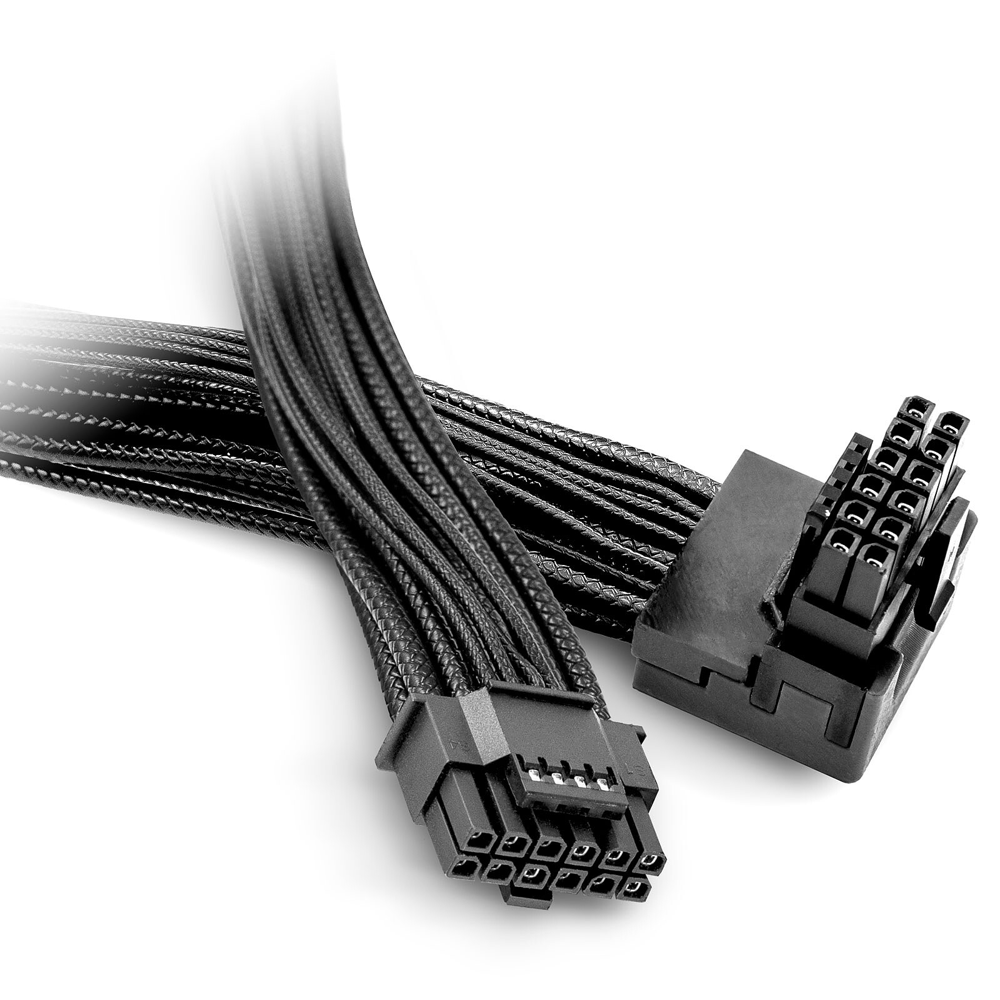

# Conector interno: 12VHPWR / 12V-2x6

**Descripción breve:** Conector moderno de alimentación para gráficas, pensado para GPUs de muy alto consumo (ej: NVIDIA RTX, PCIe 5.0).
**Pines/Carriles/Voltajes/Velocidad:** 12 pines de potencia y 4 de señal. Solo +12V. Maneja hasta 600W.
**Uso principal:** Alimentar tarjetas gráficas PCIe 5.0 de mucha potencia.
**Compatibilidad actual:** Media, solo se usan en GPUs y PSUs modernas desde 2023; antes ni existían.

## Identificación física
- Bloque compacto.
- 16 pines (12+4 más pequeños).
- Suele venir con etiquetas H+ / H++, según la versión.

## Notas técnicas
- No se recomienda usar adaptadores. 
- Hay una revisión por problemas de quemadura (la versión 12V-2x6).

## Fotos

## Fuentes
- https://hardzone.es/tutoriales/componentes/conectores-fuente-alimentacion/
- https://www.profesionalreview.com/2019/02/17/conectores-fuente-alimentacion/