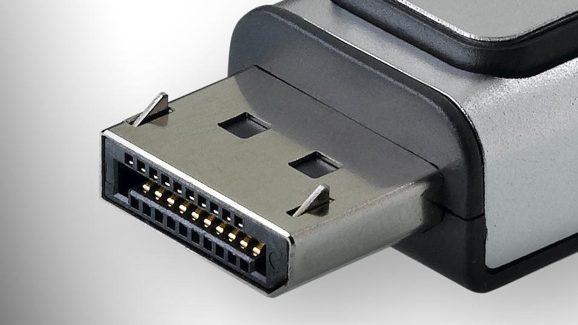

# Conector externo: DisplayPort 1.4 y 2.x

**Descripción breve:** Interfaz digital para monitores de PC de alto rendimiento, rival directo de HDMI con mayores tasas de refresco.
**Pines/Carriles/Voltajes/Velocidad:** 20 pines y 4 carriles activos de +3.3 V, alcanzando 32.4 Gb/s en DP 1.4 y 80 Gb/s en DP 2.0/2.1.
**Uso principal:** Monitores 4K/8K, VR, estaciones de trabajo y GPU profesionales.
**Compatibilidad actual:** Alta soporta conversión a HDMI y USB-C Alt Mode.

## Identificación física
- Conector trapezoidal con una esquina en bisel y pestaña de bloqueo.
- Mini-DP está disponible en portátiles.

## Notas técnicas
- DP 1.4 ofrece hasta 4K @ 120 Hz / 8K @ 60 Hz con DSC.
- DP 2.1 ofrece hasta 16K / 240 Hz, UHBR 20 (20 Gb/s por carril).
- Permite Multi-Stream Transport (MST).

## Fotos

## Fuentes
- https://www.hp.com/us-en/shop/tech-takes/displayport-vs-hdmi
- https://es.wikipedia.org/wiki/DisplayPort