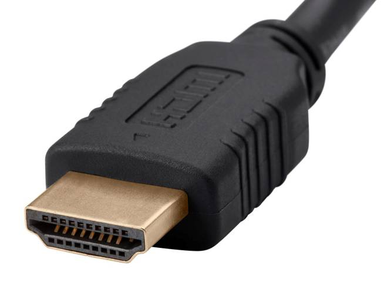

# Conector externo: HDMI 2.1

**Descripción breve:** Interfaz digital audiovisual que transmite vídeo 4K/8K y audio multicanal por un solo cable.
**Pines/Carriles/Voltajes/Velocidad:** 19 pines que transportan señales TMDS/FRL a +5 V, alcanzando hasta 48 Gb/s.
**Uso principal:** Conexión de pantallas, TVs, consolas y PCs.
**Compatibilidad actual:** Alta, estándar global audiovisual.

## Identificación física
- Conector trapezoidal ancho.
- A menudo etiquetado “HDMI 2.1” o “4K/8K”.
- Disponible en tamaños estándar, mini y micro.

## Notas técnicas
- Soporta 8K @ 60 Hz, 4K @ 120 Hz, HDR10+, eARC y VRR.
- Requiere cable “Ultra High Speed” para 48 Gb/s.

## Fotos

## Fuentes
- https://www.hdmi.org/spec/hdmi2_1