# ENTREGA ÚNICA - Reto 01

## Índice

- [Portada](#portada)
- [1. Introducción](#1-introduccion)
- [2. Conectores internos (energía)](#2-conectores-internos-energia)
- [3. Conectores de datos](#3-conectores-de-datos)
- [4. Slots de expansión](#4-slots-de-expansion)
- [5. Conectores externos](#5-conectores-externos)
- [6. Bibliografía](#6-bibliografia)

## Portada
# Reto 1 — Investigación_Desarrollo_Conectores_Slots

**Módulo:** Fundamentos de Hardware (ASIR 1º)
**Alumno:** Andrés Tahoe López Muñoz  
**Curso:** 2025/26

## 1. Introducción
# Introducción

Piensa el PC en una analogía de una ciudad con un conjunto de estructuras conectadas, cada una con una función una manera de comunicarse.
En esta ciudad, los conectores y slots son los principales medios donde pasa el flujo de energía, información y capacidades.

- **Conectores --> carreteras y puentes** 
    Son las vías que transportan energía y datos entre los diferentes componentes.  
    Algunos conectores proporcionan alimentación eléctrica y otros permiten la transferencia de información entre dispositivos, como discos duros, monitores, periféricos o tarjetas internas.  
    Al igual que las carreteras en una ciudad, su diseño y velocidad determinan el tráfico que pueden soportar (por ejemplo, SATA, USB, HDMI, o PCIe).

- **Slots --> parcelas**  
    Representan los espacios de expandibles dentro del PC.  
    En ellos se pueden instalar nuevos añadidos o “edificaciones” como tarjetas gráficas, de sonido, de red o de captura de vídeo.  
    Los slots permiten aumentar las capacidades del sistema, adaptándolo a nuevas necesidades o tecnologías emergentes.

## 2. Conectores internos (energía)

# Conector interno: 12VHPWR / 12V-2x6

**Descripción breve:** Conector moderno de alimentación para gráficas, pensado para GPUs de muy alto consumo (ej: NVIDIA RTX, PCIe 5.0).
**Pines/Carriles/Voltajes/Velocidad:** 12 pines de potencia y 4 de señal. Solo +12V. Maneja hasta 600W.
**Uso principal:** Alimentar tarjetas gráficas PCIe 5.0 de mucha potencia.
**Compatibilidad actual:** Media, solo se usan en GPUs y PSUs modernas desde 2023; antes ni existían.

## Identificación física
- Bloque compacto.
- 16 pines (12+4 más pequeños).
- Suele venir con etiquetas H+ / H++, según la versión.

## Notas técnicas
- No se recomienda usar adaptadores. 
- Hay una revisión por problemas de quemadura (la versión 12V-2x6).

## Fotos

## Fuentes
- https://hardzone.es/tutoriales/componentes/conectores-fuente-alimentacion/
- https://www.profesionalreview.com/2019/02/17/conectores-fuente-alimentacion/

# Conector interno: ATX de 24 pines

**Descripción breve:** Conector principal que alimenta la placa base en sistemas ATX/ATX12V.  
**Pines/Carriles/Voltajes/Velocidad:** 24 pines · +3.3V, +5V, +12V  
**Uso principal:** Alimentación de la placa base  
**Compatibilidad actual:** Alta

## Identificación física
- Bloque rectangular de 24 pines con clip, situado en el borde de la placa base.

## Notas técnicas
- Suele ser un bloque divisible (20+4). No confundir con el EPS 8p que es para CPU.

## Fotos

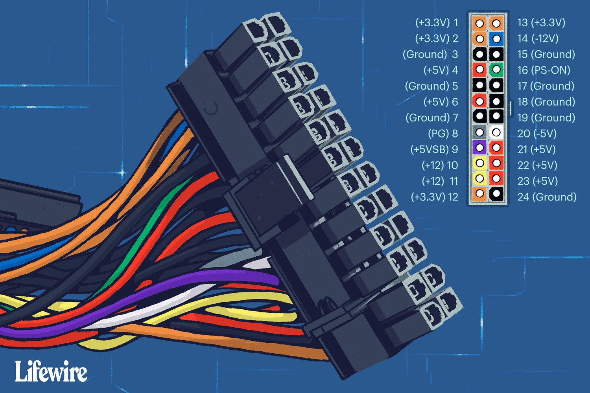
## Fuentes
- https://hardzone.es/tutoriales/componentes/conectores-fuente-alimentacion/
- https://www.profesionalreview.com/2019/02/17/conectores-fuente-alimentacion/

# Conector interno: EPS 8p (4+4)

**Descripción breve:** Alimenta el procesador a través del VRM y conector de la placa base.
**Pines/Carriles/Voltajes/Velocidad:**  8 pines, separable en 4+4. Solo +12V.
**Uso principal:** Alimentación del procesador y de sus componentes integrados.
**Compatibilidad actual:** Alta, especialmente en placas base de gama media/alta actuales.

## Identificación física
- Bloque de 8 pines.
- Puede dividirse en 4+4.
- Se encuentra normalmente cerca del socket del CPU

## Notas técnicas
- Importante no confundir con PCIe 8p (6+2)
- Para las CPUs de mucho consumo pueden haber dos conectores.

## Fotos

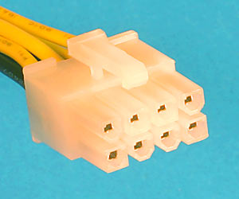
## Fuentes
- https://hardzone.es/tutoriales/componentes/conectores-fuente-alimentacion/
- https://www.profesionalreview.com/2019/02/17/conectores-fuente-alimentacion/
- https://www.geeknetic.es/VRM/que-es-y-para-que-sirve

# Conector interno: Molex (periféricos 4 pines)

**Descripción breve:** Conector usado para alimentar periféricos más clásicos, como discos duros IDE, ventiladores, controladores LED y algunas cajas. Se encuentra en desuso progresivo.
**Pines/Carriles/Voltajes/Velocidad:**  4 pines. +12V, +5V. Dos neutros o tierras (GND).
**Uso principal:** Alimentación de periféricos (ventiladores, iluminaciones, discos duros, rehobús...).
**Compatibilidad actual:** Baja, los dispositivos modernos optan por SATA power o conectores específicos, pero todavía se incluye en algunas fuentes medianas/altas.

## Identificación física
- Bloque rectangular ancho.
- 4 pines en fila
- El cable suele ser rígido y de colores (rojo, amarillo, dos negros).

## Notas técnicas
- No recomendado para alimentar componentes de alto consumo (GPU/CPU).
- Evitar adaptadores Molex a PCIe/EPS.

## Fotos

## Fuentes
- https://hardzone.es/tutoriales/componentes/conectores-fuente-alimentacion/
- https://www.profesionalreview.com/2019/02/17/conectores-fuente-alimentacion/

# Conector interno: PCIe 6/8p (6+2)

**Descripción breve:** Alimenta tarjetas gráficas (GPU) y placas base gama alta (ocasionalmente).
**Pines/Carriles/Voltajes/Velocidad:**  6 u 8 pines (8p se suele dividir en 6+2). Solo +12V.
**Uso principal:** Alimentación adicional para GPUs potentes.
**Compatibilidad actual:** Alta, en GPUs actuales se pueden usar hasta varios.

## Identificación física
- Bloque compacto o dividido.
- 6 pines o 8 pines, agrupados.
- Se rotulan normalmente como "PCIe".

## Notas técnicas
- 6p = 75W máx., 8p = 150W máx. 
- Se recomienda usar los cables separados para GPUs de alto consumo

## Fotos

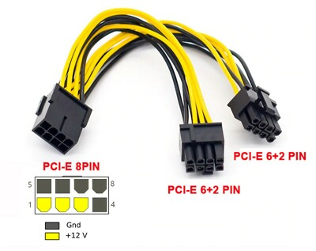
## Fuentes
- https://hardzone.es/tutoriales/componentes/conectores-fuente-alimentacion/
- https://www.profesionalreview.com/2019/02/17/conectores-fuente-alimentacion/

# Conector interno: SATA power

**Descripción breve:** Alimenta dispositivos SATA (discos HDD/SSD, ventiladores, LEDs,...).
**Pines/Carriles/Voltajes/Velocidad:** 15 pines. +3.3V, +5V, +12V.
**Uso principal:** Suministra energía a discos SATA y periféricos similares, conectados al cable SATA.
**Compatibilidad actual:** Alta, estándar para almacenamiento moderno y algunos periféricos.

## Identificación física
- Plano y ancho con 15p distribuidos.
- en forma de “L” para evitar conexión invertida.

## Notas técnicas
-  No confundir con el conector de datos SATA. 
- El cable habitualmente viene en tiras con varios conectores.

## Fotos

## Fuentes
- https://hardzone.es/tutoriales/componentes/conectores-fuente-alimentacion/
- https://www.profesionalreview.com/2019/02/17/conectores-fuente-alimentacion/

# Tabla resumen
| **Conector**          | **Descripción breve**                                                          | **Pines / Voltajes / Potencia**                     | **Uso principal**                                    | **Compatibilidad actual** | **Identificación física**                             | **Notas técnicas**                                                           |
| :-------------------- | :----------------------------------------------------------------------------- | :-------------------------------------------------- | :--------------------------------------------------- | :------------------------ | :---------------------------------------------------- | :--------------------------------------------------------------------------- |
| **12VHPWR / 12V-2x6** | Nuevo conector de alimentación gráfica para GPUs PCIe 5.0 de muy alto consumo. | 16 pines totales (12+4 señal) · +12 V · hasta 600 W | GPUs de gama alta (RTX 40 Series, etc.)              | Media                     | Bloque compacto 12+4 pines con etiquetado “H+”/“H++”. | Evitar adaptadores; versión 12V-2x6 corrige problemas de sobrecalentamiento. |
| **ATX 24 p**          | Alimenta la placa base principal de sistemas ATX.                              | 24 pines · +3.3 V / +5 V / +12 V                    | Placa base completa (chipset, ranuras, periféricos). | Alta                      | Bloque rectangular grande con clip lateral.           | Puede dividirse (20+4); no confundir con EPS 8p.                             |
| **EPS 8 p (4+4)**     | Alimenta el procesador a través del VRM.                                       | 8 pines (divisible 4+4) · +12 V                     | CPU y VRM.                                           | Alta                      | Bloque 8 pines cerca del socket CPU.                  | No confundir con PCIe 8p; placas de gama alta pueden usar dos.               |
| **Molex 4 p**         | Conector clásico para periféricos IDE, ventiladores o iluminación.             | 4 pines · +12 V / +5 V / 2 GND                      | Periféricos antiguos y ventiladores.                 | Baja                      | Bloque blanco rectangular con 4 pines en línea.       | No apto para alto consumo; evitar adaptadores a PCIe/EPS.                    |
| **PCIe 6/8 p (6+2)**  | Alimentación adicional de tarjetas gráficas.                                   | 6 u 8 pines · +12 V · 75 W (6p) / 150 W (8p)        | GPUs dedicadas.                                      | Alta                      | Agrupado (6+2) y rotulado “PCIe”.                     | Usar cables separados para GPUs potentes.                                    |
| **SATA Power**        | Alimenta unidades SATA (HDD/SSD) y periféricos.                                | 15 pines · +3.3 V / +5 V / +12 V                    | Discos duros, SSD, ventiladores, LEDs.               | Alta                      | Conector plano y ancho con forma de “L”.              | No confundir con conector de datos SATA; suele venir en tiras múltiples.     |

---

## 3. Conectores de datos

# Conector de datos: SATA (Serial ATA)

**Descripción breve:** Interfaz de datos en serie para conectar HDD/SSD/unidades ópticas.  
**Pines/Carriles/Voltajes/Velocidad:** 7 pines · 1.5/3/6 Gbps (SATA I/II/III)  
**Uso principal:** Conexión de almacenamiento interno común  
**Compatibilidad actual:** Alta

## Identificación física
- Conector plano en forma de L.
- Cables delgados, longitud típica ≤1 m.

## Notas técnicas
- Hot-swap según controladora; no lleva alimentación (va por conector SATA power).
- Retrocompatible entre versiones; existen cables con distintas longitudes y ángulos para diferentes espacios.

## Fotos

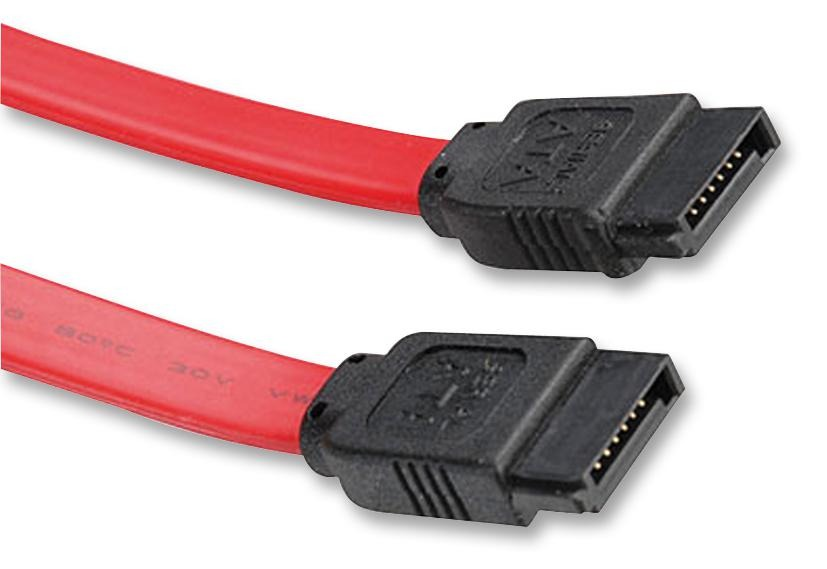
## Fuentes
- https://www.geeknetic.es/Guia/2211/Conectores-de-Placa-Base-Todos-los-tipos-y-modelos.html

# Conector de datos: M.2 (NVMe/SATA)

**Descripción breve:** Conector compacto para tarjetas de almacenamiento de alta velocidad y algún periférico. Reemplaza otras soluciones como mSATA y PCIe “tradicional”.
**Pines/Carriles/Voltajes/Velocidad:** Los pines varían según llave (forma): B, M, B+M. Puede operar en modo SATA o NVMe/PCIe (x2/x4). 
**Uso principal:** Almacenamiento SSD de alta velocidad y rendimiento, tarjetas de red y expansión en placas base modernas.
**Compatibilidad actual:** Alta, en equipos recientes. Algunas placas soportan ambos modos (NVMe/SATA), otras solo uno.

## Identificación física
- Ranura estrecha y corta sobre la placa base.
- Muescas distinguen el tipo (SATA o NVMe).

## Notas técnicas
- Es necesario verificar la compatibilidad física y eléctrica antes de instalar. 
- Existen varias longitudes estándar (30mm, 42mm, 60mm, 80mm, 110mm).

## Fotos

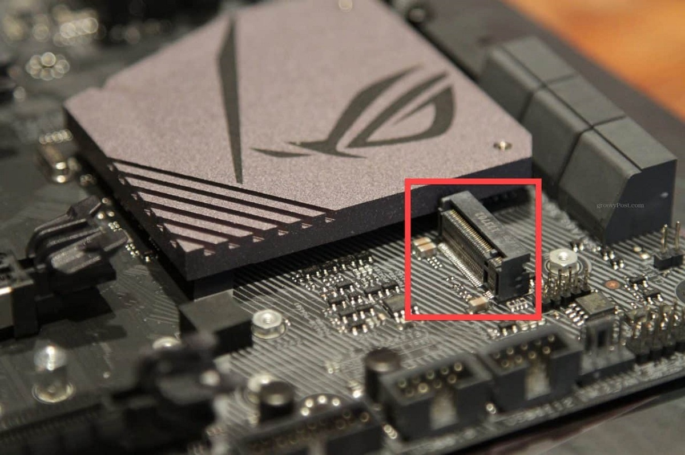

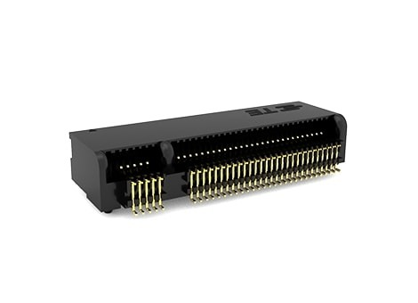
## Fuentes
- https://www.geeknetic.es/Guia/2211/Conectores-de-Placa-Base-Todos-los-tipos-y-modelos.html

# Conector de datos: SAS (Serial Attached SCSI)

**Descripción breve:** Interfaz avanzada para almacenamiento en servidores y estaciones de trabajo (Workstation). Sucesor de SCSI, da mayor velocidad y fiabilidad.
**Pines/Carriles/Voltajes/Velocidad:** 29 pines de alimentación y señales de datos, admitiendo conexiones duales (bidireccional).
**Uso principal:** Unidades HDD/SSD profesionales, especialmente en entornos empresariales y servidores.
**Compatibilidad actual:** Muy alta en ámbito profesional. Los controladores SAS aceptan discos SATA pero no al revés.

## Identificación física
- Conector alargado
- Doble sección separada para datos y alimentación. 
- Suele distinguirse por la etiqueta y tamaño.

## Notas técnicas
- Admite hot swap, multipath y redundancia.
- Frecuentemente usado en configuraciones RAID.

## Fotos
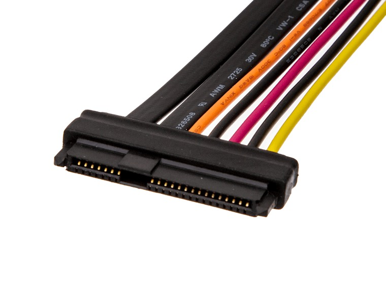

## Fuentes
- https://www.geeknetic.es/Guia/2211/Conectores-de-Placa-Base-Todos-los-tipos-y-modelos.html
- https://es.wikipedia.org/wiki/Serial_Attached_SCSI
---

## 4. Slots de expansión

# Slot expansión: PCIe Express x1

**Descripción breve:** Versión compacta del estándar PCI Express con un solo carril de datos, usada para tarjetas pequeñas de conectividad o sonido.
**Pines/Carriles/Voltajes/Velocidad:** 36 pines y 1 carril activo de +3,3 V y +12 V, con velocidades de 1 GB/s (Gen 3), 2 GB/s (Gen 4) y 4 GB/s (Gen 5).
**Uso principal:** Tarjetas Wi-Fi, Bluetooth, sonido, TV y adaptadores de USB/SATA.
**Compatibilidad actual:** Alta, puede instalarse también en ranuras mayores (x4/x8/x16).

## Identificación física
- Ranura corta (de 25 mm) con una sola muesca.
- Suele ubicarse en la parte inferior de la placa madre.

## Notas técnicas
- Limitado en ancho de banda, pero suficiente para periféricos ligeros.
- Es retrocompatible entre generaciones PCIe.
- Funciona en ranuras parcialmente abiertas.

## Fotos

## Fuentes
- https://www.profesionalreview.com/2018/12/10/conectores-pci-express-x16-x8-x4-y-x1/
- https://www.sinsmarts.com/es/blog/pcie-x1-x4-x8-x16-x32what-is-the-difference/
- https://www.hp.com/us-en/shop/tech-takes/what-are-pcie-slots-pc
- https://ibericavip.com/blog/pc-workstation/todos-los-tipos-de-ranuras-pcie-explicados-y-comparados/

# Slot expansión: PCIe Express x4

**Descripción breve:** Interfaz PCI Express con cuatro carriles de comunicación bidireccional, ideal para tarjetas Thunderbolt y controladoras de red, entre otros.
**Pines/Carriles/Voltajes/Velocidad:** 64 pines y 4 carriles activos de +3,3 V y +12 V, alcanzando 4 GB/s (Gen 3), 8 GB/s (Gen 4) y 16 GB/s (Gen 5).
**Uso principal:** Discos NVMe, adaptadores Thunderbolt y tarjetas USB/SATA de rendimiento medio.
**Compatibilidad actual:** Alta, puede instalarse en ranuras x4, x8 o x16 sin pérdida funcional.

## Identificación física
- Más corta que la x8 y x16, con una sola muesca.
- A menudo identificada por color o etiqueta en la placa.

## Notas técnicas
- Proporciona ancho de banda suficiente para SSDs PCIe 4.0/5.0.
- En Gen 5 alcanza 64 Gb/s efectivos.
- Muy utilizada en ranuras M.2 y U.2 para almacenamiento.

## Fotos

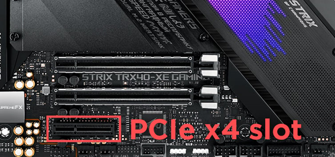
## Fuentes
- https://www.profesionalreview.com/2018/12/10/conectores-pci-express-x16-x8-x4-y-x1/
- https://www.sinsmarts.com/es/blog/pcie-x1-x4-x8-x16-x32what-is-the-difference/
- https://www.hp.com/us-en/shop/tech-takes/what-are-pcie-slots-pc
- https://ibericavip.com/blog/pc-workstation/todos-los-tipos-de-ranuras-pcie-explicados-y-comparados/

# Slot expansión: PCIe Express x8

**Descripción breve:** La ranura de expansión PCI Express con ocho carriles de datos bidireccionales. Equilibra ancho de banda y consumo, usada en controladoras, tarjetas de red y algunas GPUs.
**Pines/Carriles/Voltajes/Velocidad:** 98 pines y 8 carriles activos de +3,3 V y +12 V, alcanzando velocidades aproximadas de 8 GB/s (Gen 3), 16 GB/s (Gen 4) y 32 GB/s (Gen 5).
**Uso principal:** Tarjetas de red 10–100 GbE, controladoras RAID/NVMe y aceleradoras FPGA o IA.
**Compatibilidad actual:** Alta, retrocompatible con otras ranuras PCIe.

## Identificación física
- Longitud media entre la ranura x4 y x16.
- Muesca igual que otras PCIe; color depende del fabricante.
- Ubicada normalmente junto a la ranura principal x16.

## Notas técnicas
- Puede insertarse en ranura x16 funcionando a x8 si está cableada.
- PCIe Gen 5 x8 ofrece 128 Gb/s de ancho de banda total.
- Requiere un trazado corto y buena integridad de señal a altas frecuencias.

## Fotos

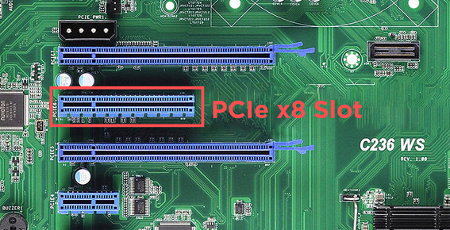
## Fuentes
- https://www.profesionalreview.com/2018/12/10/conectores-pci-express-x16-x8-x4-y-x1/
- https://www.sinsmarts.com/es/blog/pcie-x1-x4-x8-x16-x32what-is-the-difference/
- https://www.hp.com/us-en/shop/tech-takes/what-are-pcie-slots-pc
- https://ibericavip.com/blog/pc-workstation/todos-los-tipos-de-ranuras-pcie-explicados-y-comparados/

# Slot expansión: PCI Express x16 (Gen4/Gen5)

**Descripción breve:** Ranura de expansión de altas prestaciones usada para GPUs/aceleradoras.  
**Pines/Carriles/Voltajes/Velocidad:** x16 carriles · Gen4 16 GT/s · Gen5 32 GT/s  
**Uso principal:** Tarjetas gráficas; también aceleradoras y NVMe en adaptador  
**Compatibilidad actual:** Alta

## Identificación física
- Ranura larga con pestaña; color variable por fabricante.

## Notas técnicas
- Ancho de banda efectivo depende de generación y carriles disponibles (CPU/Chipset).

## Fotos

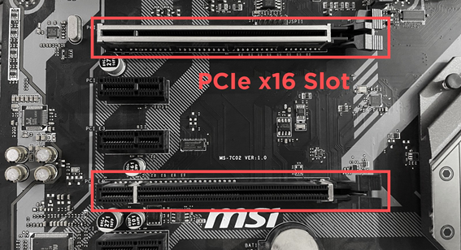
## Fuentes
- https://pcisig.com/

# Slot expansión: M.2 para Wi-Fi/BT

**Descripción breve:** Es una ranura compacta y versátil presente en placas base modernas que puede albergar diversos dispositivos.
**Pines/Carriles/Voltajes/Velocidad:** Los pines varían con el tipo de clave (Key A, Key E o Key M). Las tarjetas Wi-Fi/BT usualmente usan Key A o E.  
**Uso principal:** Instalación de tarjetas Wi-Fi, Bluetooth y otras soluciones inalámbricas integradas en el sistema.
**Compatibilidad actual:** Alta en placas recientes, con soporte específico para módulos.

## Identificación física
- Ranura corta y rectangular
- Muesca que indica el tipo de clave y el tipo de tarjeta compatible. 
- Se ubica típicamente cerca del área de expansión o antenas del equipo.

## Notas técnicas
- Necesita verificar la compatibilidad de la placa base con el tipo de módulo (PCIe o USB) y la clave de la ranura.

## Fotos

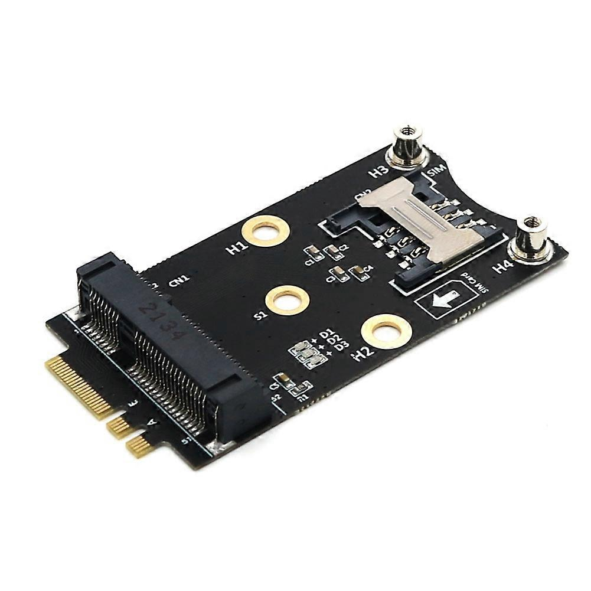
## Fuentes
- www.geeknetic.es/Guia/2211/Conectores-de-Placa-Base-Todos-los-tipos-y-modelos.html
---

## 5. Conectores externos

# Conector externo: USB-A 2.0 / 3.x

**Descripción breve:** Conector rectangular estándar desde los 2000, usado para periféricos, almacenamiento y carga básica.
**Pines/Carriles/Voltajes/Velocidad:** 4 pines (USB 2.0) o 9 pines (USB 3.x) de +5 V, ofreciendo 480 Mb/s (USB 2.0), 5 Gb/s (USB 3.0) y 10 Gb/s (USB 3.1).
**Uso principal:** Conexión de teclado, ratón, pendrive, cámaras y discos externos.
**Compatibilidad actual:** Alta, universal y aún presente en PCs.

## Identificación física
- Forma rectangular con lengüeta plástica interna de color
- Colores: blanco = 2.0, azul = 3.x. Otros colores dependen del fabricante.
- No reversible.

## Notas técnicas
- Retrocompatible hacia versiones anteriores.
- Limitado a 5 V, 900 mA sin PD.
- USB 3.x puede operar en modo SuperSpeed y SuperSpeed+.

## Fotos

## Fuentes
- https://usb.org/
- https://www.xataka.com/basics/tipos-usb-estandares-conectores-caracteristicas-cada-uno
- https://www.pccomponentes.com/que-es-y-para-que-sirve-el-usb-40
- https://hardzone.es/noticias/componentes/colores-puerto-usb/

# Conector externo: USB-B

**Descripción breve:** Conector cuadrado usado principalmente en impresoras, escáneres y dispositivos industriales.
**Pines/Carriles/Voltajes/Velocidad:** 4 pines de +5 V para USB 2.0 o 9 pines en USB 3.x, alcanzando hasta 5 Gb/s.
**Uso principal:** Conexión de periféricos de oficina o equipos industriales al PC.
**Compatibilidad actual:** Media, reemplazado por USB-C, aunque sigue en impresoras y DACs.

## Identificación física
- Conector casi cuadrado con esquinas biseladas.
- Es azul en versión 3.x.

## Notas técnicas
- Conectores 3.x son físicamente más largos pero aceptan cables 2.0.
- No reversible.

## Fotos

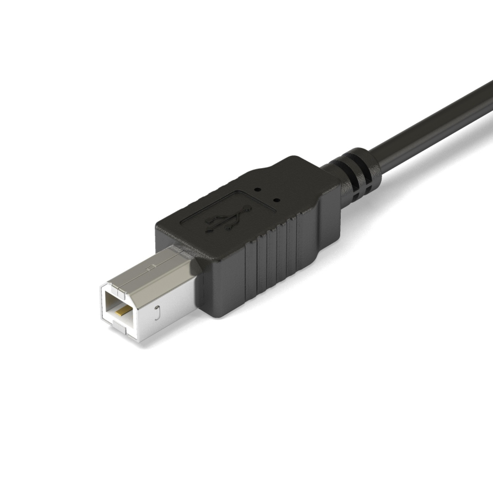
## Fuentes
- https://usb.org/
- https://www.xataka.com/basics/tipos-usb-estandares-conectores-caracteristicas-cada-uno
- https://www.pccomponentes.com/que-es-y-para-que-sirve-el-usb-40
- https://www.usb.org/defined-class-codes

# Conector externo: USB-C (USB4/PD)

**Descripción breve:** Conector reversible para datos, vídeo y alimentación (PD).  
**Pines/Carriles/Voltajes/Velocidad:** 24 pines · USB4 hasta 40 Gbps · PD hasta 100–240 W (según perfil)  
**Uso principal:** Carga y conexión de periféricos/monitores/docks  
**Compatibilidad actual:** Alta (ojo: no todo USB-C soporta TB/PD)

## Identificación física
- Ovalado y simétrico; símbolos: rayo (Thunderbolt), “SS” (SuperSpeed).

## Notas técnicas
- Requisitos de cable para 40 Gbps/240 W; DP Alt Mode para vídeo si no es TB.

## Fotos

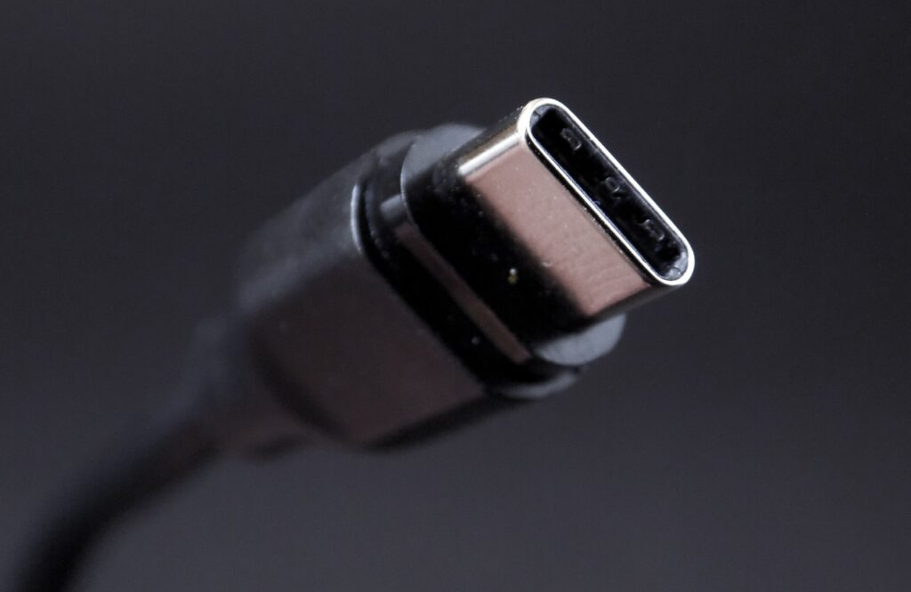
## Fuentes
- https://usb.org/
- https://www.xataka.com/basics/tipos-usb-estandares-conectores-caracteristicas-cada-uno
- https://www.pccomponentes.com/que-es-y-para-que-sirve-el-usb-40
- https://www.geeknetic.es/Guia/2242/USB4-Velocidad-y-Caracteristicas.html

# Conector externo: HDMI 2.1

**Descripción breve:** Interfaz digital audiovisual que transmite vídeo 4K/8K y audio multicanal por un solo cable.
**Pines/Carriles/Voltajes/Velocidad:** 19 pines que transportan señales TMDS/FRL a +5 V, alcanzando hasta 48 Gb/s.
**Uso principal:** Conexión de pantallas, TVs, consolas y PCs.
**Compatibilidad actual:** Alta, estándar global audiovisual.

## Identificación física
- Conector trapezoidal ancho.
- A menudo etiquetado “HDMI 2.1” o “4K/8K”.
- Disponible en tamaños estándar, mini y micro.

## Notas técnicas
- Soporta 8K @ 60 Hz, 4K @ 120 Hz, HDR10+, eARC y VRR.
- Requiere cable “Ultra High Speed” para 48 Gb/s.

## Fotos

## Fuentes
- https://www.hdmi.org/spec/hdmi2_1

# Conector externo: DisplayPort 1.4 y 2.x

**Descripción breve:** Interfaz digital para monitores de PC de alto rendimiento, rival directo de HDMI con mayores tasas de refresco.
**Pines/Carriles/Voltajes/Velocidad:** 20 pines y 4 carriles activos de +3.3 V, alcanzando 32.4 Gb/s en DP 1.4 y 80 Gb/s en DP 2.0/2.1.
**Uso principal:** Monitores 4K/8K, VR, estaciones de trabajo y GPU profesionales.
**Compatibilidad actual:** Alta soporta conversión a HDMI y USB-C Alt Mode.

## Identificación física
- Conector trapezoidal con una esquina en bisel y pestaña de bloqueo.
- Mini-DP está disponible en portátiles.

## Notas técnicas
- DP 1.4 ofrece hasta 4K @ 120 Hz / 8K @ 60 Hz con DSC.
- DP 2.1 ofrece hasta 16K / 240 Hz, UHBR 20 (20 Gb/s por carril).
- Permite Multi-Stream Transport (MST).

## Fotos

## Fuentes
- https://www.hp.com/us-en/shop/tech-takes/displayport-vs-hdmi
- https://es.wikipedia.org/wiki/DisplayPort

# Conector externo: VGA (DE-15)

**Descripción breve:** Interfaz analógica de vídeo de 15 pines utilizada desde los años 90 para monitores CRT y LCD.
**Pines/Carriles/Voltajes/Velocidad:** 15 pines (3 filas de 5) con señal RGB analógica + H/V sync, de 0.7 V p-p por canal y frecuencias de hasta 250 MHz.
**Uso principal:** Conexión de monitores antiguos, proyectores y equipos industriales.
**Compatibilidad actual:** Baja, obsoleto por ser reemplazado por HDMI y DisplayPort.

## Identificación física
- Conector trapezoidal azul (DE-15) con tornillos laterales.
- A menudo etiquetado “VGA” o “RGB OUT”.
## Notas técnicas
- Limitada a resoluciones máx. 2048×1536 @ 60 Hz.
- Solo transmite vídeo analógico (sin audio).
- Sensible a interferencias y degradación por cable largo.

## Fotos

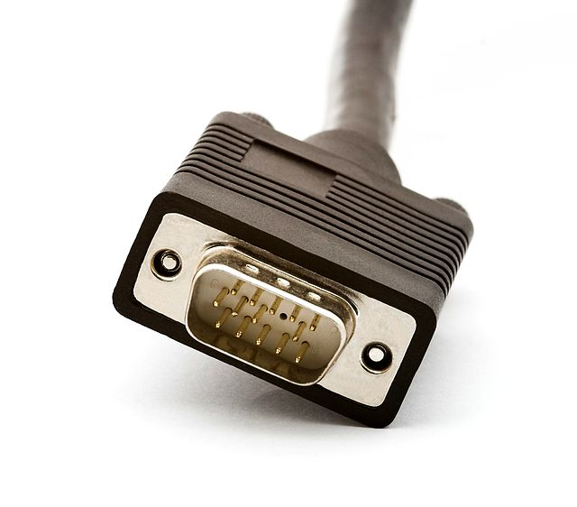
## Fuentes
- https://es.wikipedia.org/wiki/Video_Graphics_Array
- https://www.lenovo.com/mx/es/glosario/vga/

# Conector externo: RJ-45 (Ethernet 1G/2.5G/10G)

**Descripción breve:** Conector de red de 8 pines usado para redes Ethernet LAN con velocidades de hasta 10 Gb/s.
**Pines/Carriles/Voltajes/Velocidad:** 8 pines (4 pares trenzados) sin voltaje propio. Transfiere datos a 1 Gb/s (1000BASE-T), 2.5 Gb/s (2.5GBASE-T) o 10 Gb/s (10GBASE-T).
**Uso principal:** Redes domésticas, empresariales y equipos de telecomunicaciones.
**Compatibilidad actual:** Alta, estándar universal de red cableada.

## Identificación física
- Conector rectangular transparente tipo 8P8C con clip plástico.
- Normalmente ubicado en parte trasera de PCs, routers, switches, hubs... etc.
## Notas técnicas
- Cables CAT5e → 1 Gb/s.
- CAT6 → 10 Gb/s hasta 55 m.
- CAT6A / CAT7 → 10 Gb/s hasta 100 m.
- Soporta PoE hasta 90 W (IEEE 802.3bt).

## Fotos

## Fuentes
- https://www.ruijie.com/en-global/support/faq/what-is-rj45-port
- https://es.wikipedia.org/wiki/RJ-45
---

## 6. Bibliografía
# Bibliografía y fuentes

- https://hardzone.es/tutoriales/componentes/conectores-fuente-alimentacion/
- https://www.profesionalreview.com/2019/02/17/conectores-fuente-alimentacion/
- https://www.geeknetic.es/Guia/2211/Conectores-de-Placa-Base-Todos-los-tipos-y-modelos.html
- https://www.profesionalreview.com/2018/12/10/conectores-pci-express-x16-x8-x4-y-x1/
- https://www.sinsmarts.com/es/blog/pcie-x1-x4-x8-x16-x32what-is-the-difference/
- https://ibericavip.com/blog/pc-workstation/todos-los-tipos-de-ranuras-pcie-explicados-y-comparados/
- https://www.hp.com/us-en/shop/tech-takes/what-are-pcie-slots-pc
- https://usb.org/
- https://www.xataka.com/basics/tipos-usb-estandares-conectores-caracteristicas-cada-uno
- https://www.pccomponentes.com/que-es-y-para-que-sirve-el-usb-40
- https://hardzone.es/noticias/componentes/colores-puerto-usb/
- https://www.geeknetic.es/Guia/2242/USB4-Velocidad-y-Caracteristicas.html
- https://www.usb.org/defined-class-codes
- https://www.hdmi.org/spec/hdmi2_1
- https://www.hp.com/us-en/shop/tech-takes/displayport-vs-hdmi
- https://es.wikipedia.org/wiki/DisplayPort
- https://es.wikipedia.org/wiki/Video_Graphics_Array
- https://www.lenovo.com/mx/es/glosario/vga/
