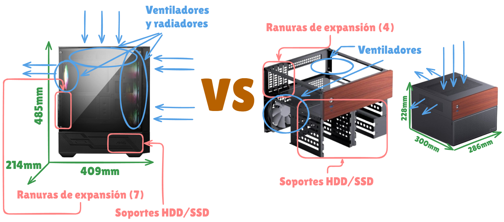

# Formatos de chasis: diagrama y análisis

**Formatos elegidos:** ATX vs ITX

## Diagrama

## Impacto del tamaño

- **Capacidad de componentes:**
	- El chasis ATX de media torre, es más grande fisicamente, dejando instalar placas base ATX, Micro-ATX y Mini-ITX, tarjetas gráficas de hasta 330 mm y fuentes de alimentación de hasta 200 mm. Cuenta con 7 ranuras de expansión, bahías para HDD y SSD, y espacio suficiente para ventiladores y disipadores/radiadores.
	- Por otro lado, el chasis ITX es más compacto, solo admite placas base ITX o Micro-ATX, solo deja instalar un ventilador y un disipador pequeño, pero este modelo en concreto tiene bastantes bahías para almacenamiento HDD y SSD.

- **Refrigeración:** 
	- El ATX admite hasta 6 ventiladores de 120 mm, además de radiadores de 240 mm en los paneles frontal y superior, lo que permite un flujo de aire excelente y opciones de refrigeración líquida avanzadas.
	- En cambio, el ITX, debido a su tamaño compacto, tiene un flujo de aire más limitado y solo permite refrigeración con ventiladores más pequeños o soluciones de bajo perfil; es más difícil instalar radiadores grandes o múltiples ventiladores, por lo que se recomienda usar componentes de bajo consumo o disipadores compactos.

- **Uso típico:**  
	- El ATX, por su tamaño y compatibilidad con componentes grandes, es ideal para equipos de gaming de alto rendimiento, estaciones de trabajo o creadores de contenido que necesitan expansión y refrigeración eficiente. 
	- En cambio, el ITX, por ser un chasis pequeño y elegante, es perfecto para setups minimalistas, PCs de oficina avanzada o gaming compacto, donde el espacio es limitado y se prioriza un diseño compacto y eficiente sobre la capacidad de expansión.

### Chasis elegidos:
- [ATX](https://www.amazon.es/MSI-FORGE-112R-Mid-Tower-Tipo/dp/B09RGHK5CY?source=ps-sl-shoppingads-lpcontext&ref_=fplfs&smid=A1AT7YVPFBWXBL&language=es_ES&th=1)
- [ITX](https://www.pccomponentes.com/torre-pc-caja-micro-torre-jonsbo-n4-black-acero-madera-negro-itx-micro-atx-sfx)