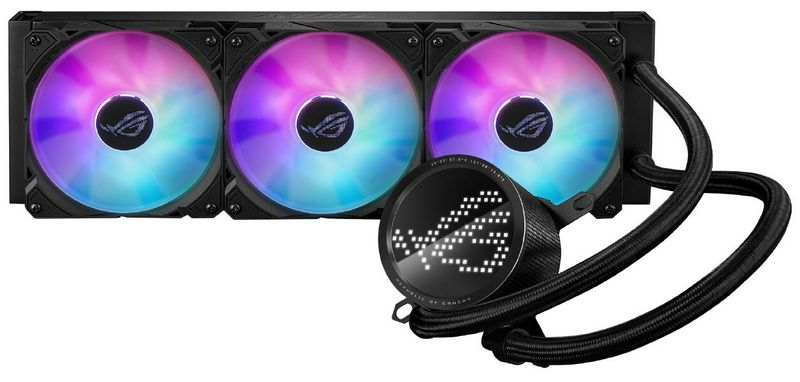
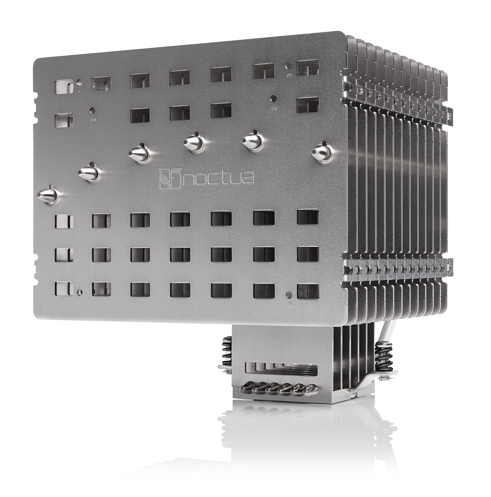

# Parte 1 — Actividades A y B (único archivo)

---
## Actividad A — Investigación de **Fuentes de Alimentación** 

**Instrucciones:**
1. Elige **3 tiendas online españolas/especializadas** (p. ej., PcComponentes, Amazon ES, LDLC ES).
2. En **cada tienda**, selecciona **un modelo ATX**, **uno SFX** y **uno TFX** (total 9).
3. Para cada modelo, recoge: **Marca/Modelo**, **Potencia (W)**, **Certificación 80 PLUS**, **Precio (€)**, **Modularidad**, **PFC (activo/pasivo)**, **Dimensiones (mm)**, **Enlace**.
4. Al final, incluye una **tabla resumen comparativa global**.

### Tienda 1: [PC Componentes](https://www.pccomponentes.com/) 

| Tipo | Marca/Modelo           | Potencia (W) | 80 PLUS  | Precio (€) | Modularidad | PFC    | Dimensiones (L×W×H mm) | Enlace                                                                                                                             |
| ---- | ---------------------- | ------------ | -------- | ---------: | ----------- | ------ | ---------------------- | ---------------------------------------------------------------------------------------------------------------------------------- |
| ATX  | Corsair CX650          | 650          | Bronze   |     59,99€ | No          | Activo | 140x150x86             | [📎](https://www.pccomponentes.com/corsair-cx650-650-w-80-plus-bronze)                                                             |
| SFX  | ASUS ROG Loki SFX-L    | 1000         | Platinum |    241,24€ | Sí          | Activo | 125x125x63.5           | [📎](https://www.pccomponentes.com/asus-rog-loki-sfx-l-1000w-80-plus-platinum-modular)                                             |
| TFX  | Tacens Anima Aptii500p | 500          | No       |     22,64€ | No          | Activo | 150x85x65              | [📎](https://www.pccomponentes.com/tacens-anima-aptii500p-fuente-alimentacion-tfx-500w-ultracompacta-85-smd-ventilador-80mm-negro) |

**Notas/criterios de la tienda 1:** PC Componentes cuenta con muchas fuentes ATX, incluyendo su marca propia "Tempest", la mayoría orientadas a gaming. Pero fuentes TFX cuenta con muy pocas, siendo muy genéricas.

### Tienda 2: [Coolmod](https://www.coolmod.com/)

| Tipo | Marca/Modelo          | Potencia (W) | 80 PLUS | Precio (€) | Modularidad | PFC    | Dimensiones (L×W×H mm) | Enlace                                                                                                                                                                                                                    |
| ---- | --------------------- | ------------ | ------- | ---------: | ----------- | ------ | ---------------------- | ------------------------------------------------------------------------------------------------------------------------------------------------------------------------------------------------------------------------- |
| ATX  | DeepCool PN850D       | 850          | Gold    |    139,95€ | No          | Activo | 140x150x86             | [📎](https://www.coolmod.com/deepcool-pn850d-80-plus-gold-850w-atx-3-1-pcie-5-1/?_gl=1*685b55*_up*MQ..*_gs*MQ..&gclid=EAIaIQobChMIjsqv7afqkAMVz8p5BB0pegs9EAAYASAAEgI68fD_BwE&gbraid=0AAAAAD_BC_PUCflhN-SQxSRmMDeZrsYgg)  |
| SFX  | Lian Li SP750         | 750          | Gold    |    138,94€ | Sí          | Activo | 100x125x63.5           | [📎](https://www.coolmod.com/lian-li-sp750-sfx-80-plus-gold-750w-modular-blanco/?_gl=1*1ilsahj*_up*MQ..*_gs*MQ..&gclid=EAIaIQobChMIjsqv7afqkAMVz8p5BB0pegs9EAAYASAAEgI68fD_BwE&gbraid=0AAAAAD_BC_PUCflhN-SQxSRmMDeZrsYgg) |
| TFX  | Coolbox Basic 500GR-T | 500          | No      |     18,95€ | No          | Pasivo | 175x85x65              | [📎](https://www.coolmod.com/deepcool-pn850d-80-plus-gold-850w-atx-3-1-pcie-5-1/?_gl=1*685b55*_up*MQ..*_gs*MQ..&gclid=EAIaIQobChMIjsqv7afqkAMVz8p5BB0pegs9EAAYASAAEgI68fD_BwE&gbraid=0AAAAAD_BC_PUCflhN-SQxSRmMDeZrsYgg)  |

**Notas/criterios de la tienda 2:** Coolmod también tiene bastante variedad en ATX para  multitud de presupuestos y potencias, pero en cuento a SFX y TFX tienen muy pocas alternativas.

### Tienda 3: [LDLC](https://www.ldlc.com/)

| Tipo | Marca/Modelo          | Potencia (W) | 80 PLUS  | Precio (€) | Modularidad | PFC    | Dimensiones (L×W×H mm) | Enlace                                                 |
| ---- | --------------------- | ------------ | -------- | ---------: | ----------- | ------ | ---------------------- | ------------------------------------------------------ |
| ATX  | ASUS Pro Workstation  | 3000         | Platinum |    809,95€ | Sí          | Activo | 175x150x86             | [📎](https://www.ldlc.com/es-es/ficha/PB00705581.html) |
| SFX  | Thermalright TGFX-750 | 750          | Gold     |    111,95€ | Sí          | Activo | 100x125x63.5           | [📎](https://www.ldlc.com/es-es/ficha/PB00674006.html) |
| TFX  | be quiet! TFX Power 3 | 300          | Gold     |     76,95€ | No          | Activo | 175x85x65              | [📎](https://www.ldlc.com/es-es/ficha/PB00430598.html) |

**Notas/criterios de la tienda 3:** En LDLC encuentras variedad más allá que solo "gaming", por ejemplo, venden fuentes para Workstation de 3000W, que es un producto para un entorno más profesional. Además, por esa razón, tambien tiene más opciones para SFX y TFX.

#### Tabla **resumen comparativa** (global, 9 modelos)
| Tienda         | Tipo | Marca/Modelo           | Potencia (W) | 80 PLUS  | Precio (€) | Modularidad | PFC    | Dimensiones (mm) | Observaciones (enlace)                                                                                                                                                                                                    |
| -------------- | ---- | ---------------------- | ------------ | -------- | ---------: | ----------- | ------ | ---------------- | ------------------------------------------------------------------------------------------------------------------------------------------------------------------------------------------------------------------------- |
| PC Componentes | ATX  | Corsair CX650          | 650          | Bronze   |     59,99€ | No          | Activo | 140x150x86       | [📎](https://www.pccomponentes.com/corsair-cx650-650-w-80-plus-bronze)                                                                                                                                                    |
| PC Componentes | SFX  | ASUS ROG Loki SFX-L    | 1000         | Platinum |    241,24€ | Sí          | Activo | 125x125x63.5     | [📎](https://www.pccomponentes.com/asus-rog-loki-sfx-l-1000w-80-plus-platinum-modular)                                                                                                                                    |
| PC Componentes | TFX  | Tacens Anima Aptii500p | 500          | No       |     22,64€ | No          | Activo | 150x85x65        | [📎](https://www.pccomponentes.com/tacens-anima-aptii500p-fuente-alimentacion-tfx-500w-ultracompacta-85-smd-ventilador-80mm-negro)                                                                                        |
| Coolmod        | ATX  | DeepCool PN850D        | 850          | Gold     |    139,95€ | No          | Activo | 140x150x86       | [📎](https://www.coolmod.com/deepcool-pn850d-80-plus-gold-850w-atx-3-1-pcie-5-1/?_gl=1*685b55*_up*MQ..*_gs*MQ..&gclid=EAIaIQobChMIjsqv7afqkAMVz8p5BB0pegs9EAAYASAAEgI68fD_BwE&gbraid=0AAAAAD_BC_PUCflhN-SQxSRmMDeZrsYgg)  |
| Coolmod        | SFX  | Lian Li SP750          | 750          | Gold     |    138,94€ | Sí          | Activo | 100x125x63.5     | [📎](https://www.coolmod.com/lian-li-sp750-sfx-80-plus-gold-750w-modular-blanco/?_gl=1*1ilsahj*_up*MQ..*_gs*MQ..&gclid=EAIaIQobChMIjsqv7afqkAMVz8p5BB0pegs9EAAYASAAEgI68fD_BwE&gbraid=0AAAAAD_BC_PUCflhN-SQxSRmMDeZrsYgg) |
| Coolmod        | TFX  | Coolbox Basic 500GR-T  | 500          | No       |     18,95€ | No          | Pasivo | 175x85x65        | [📎](https://www.coolmod.com/deepcool-pn850d-80-plus-gold-850w-atx-3-1-pcie-5-1/?_gl=1*685b55*_up*MQ..*_gs*MQ..&gclid=EAIaIQobChMIjsqv7afqkAMVz8p5BB0pegs9EAAYASAAEgI68fD_BwE&gbraid=0AAAAAD_BC_PUCflhN-SQxSRmMDeZrsYgg)  |
| LDLC           | ATX  | ASUS Pro Workstation   | 3000         | Platinum |    809,95€ | Sí          | Activo | 175x150x86       | [📎](https://www.ldlc.com/es-es/ficha/PB00705581.html)                                                                                                                                                                    |
| LDLC           | SFX  | Thermalright TGFX-750  | 750          | Gold     |    111,95€ | Sí          | Activo | 100x125x63.5     | [📎](https://www.ldlc.com/es-es/ficha/PB00674006.html)                                                                                                                                                                    |
| LDLC           | TFX  | be quiet! TFX Power 3  | 300          | Gold     |     76,95€ | No          | Activo | 175x85x65        | [📎](https://www.ldlc.com/es-es/ficha/PB00430598.html)                                                                                                                                                                    |

---
## Actividad B — **Refrigeración para la MISMA CPU** (Líquida vs Pasiva)

**Instrucciones:**
1. Elige una **CPU concreta** (ej.: Intel Core i9-13900, AMD Ryzen 9 7950X…). Indícala abajo.
2. Selecciona **una refrigeración líquida AIO** y **una refrigeración pasiva** **compatibles** con esa CPU. Incluye **URLs** oficiales o de tienda.
3. Compara **precio, eficiencia térmica (TDP soportado/temperaturas), ruido, dimensiones, compatibilidad de socket, mantenimiento, garantía**…
4. **Concluye** con recomendaciones por perfil (**gamer**, **diseño/pro**, **usuario estándar**) y **calidad-precio**.

**CPU elegida:** AMD Ryzen 5 5600X

### Modelos evaluados
| Tipo          | Marca/Modelo               | Precio (€) | TDP soportado / Rendimiento térmico | Ruido (dBA) | Dimensiones (mm) | Sockets | Mantenimiento                            | Garantía | Enlace                                                                                         |
| ------------- | -------------------------- | ---------: | ----------------------------------- | ----------- | ---------------- | ------- | ---------------------------------------- | -------- | ---------------------------------------------------------------------------------------------- |
| Líquida (AIO) | ASUS ROG Ryuo III 360 ARGB |    275,00€ | 250W                                | 36.45       | 120x120x25       | AM4     | Limpieza radiador, ventiladores y bomba. | 6 años   | [📎](https://rog.asus.com/es/cooling/cpu-liquid-coolers/rog-ryuo/rog-ryuo-iii-360-argb-model/) |
| Pasiva        | Noctua NH-P1               |    119,90€ | 100W                                | 0           | 152x154x158      | AM4     | Limpieza del disipador.                  | 6 años   | [📎](https://www.noctua.at/en/products/nh-p1)                                                  |

#### Líquida

#### Pasiva

### Análisis y elección por perfil
- **Gamer:**  Para jugar a videojuegos, se le requiere más exigencia a la CPU para poder jugar con un framerate estable. Esto genera muchísimo calor y lo mejor es usar una refrigeración liquida que disipe todo ese calor.
- **Profesional de diseño/simulación:**  Para realizar trabajos de diseño y simulación se le exige a la CPU mucha potencia de cálculo para simular situaciones o para usar software de diseño exigentes. Por tanto, hay que usar una refrigeración liquida que pueda mantener temperaturas bajas.
- **Usuario estándar/ofimática:**  Este tipo de usuarios no se les requiere mucha potencia en la CPU, ya que los programas de ofimática o navegadores web no calientan demasiado el PC. Por tanto en este caso y para no tener ruidos constante en una oficina, se pueden usar disipadores pasivos, que van a limitar el uso de la CPU pero es más silencioso.

### Conclusión general

La refrigeración líquida es la mejor opción si quieres usar toda la potencia de la CPU, como gamers o profesionales que quieren que el procesador se mantenga frio mucho estrés. Esta opción ofrece más disipación del calor y por tanto, la CPU no tenga problemas de temperatura, aunque suelen costar más y requieren mantenimiento. Por otro lado, el disipador pasivo es para para personas que solo hacen tareas muy básicas, ya que no genera ruido y casi no necesita mantenimiento, aunque no es tan efectivo si vas a usar algo mas demandante y limita un poco el rendimiento. Entonces para usar la potencia máxima del CPU y estabilidad en temperaturas, mejor la líquida. Si prefieres silencio y simplicidad para tareas simples, el disipador pasivo es una opción. La elección depende del usuario del ordenador y de las tareas que haga en el ordenador.