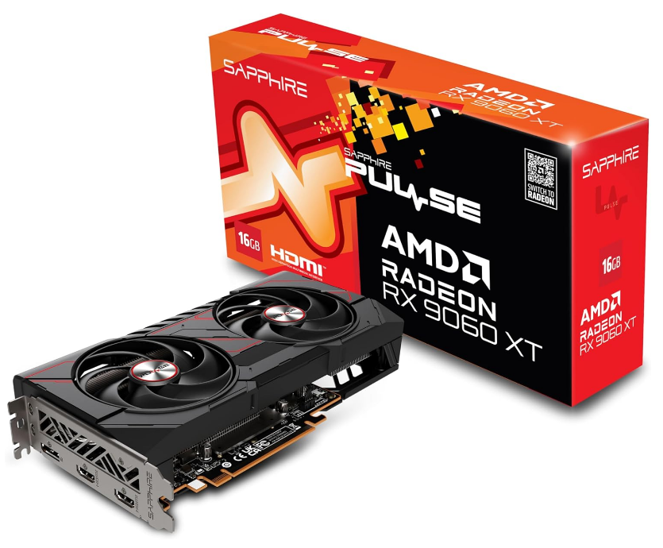
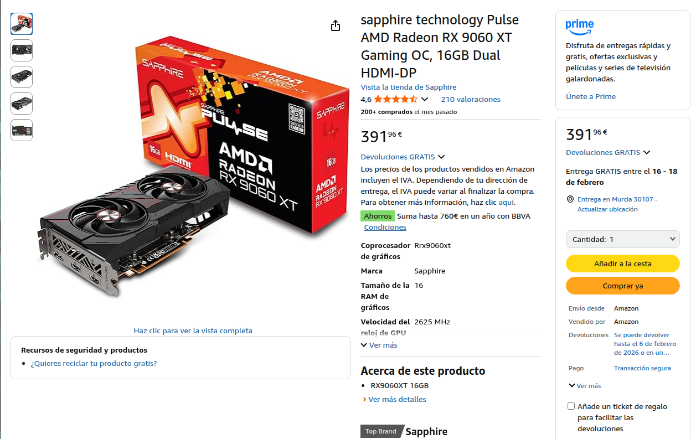
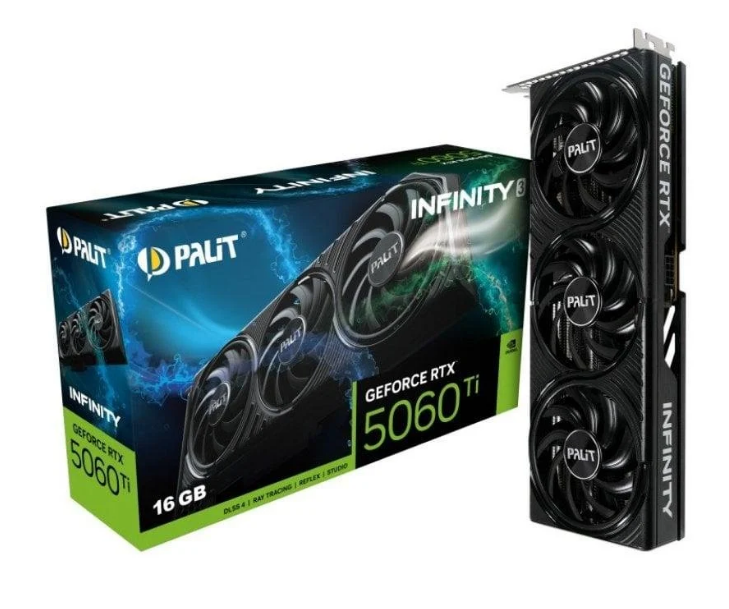
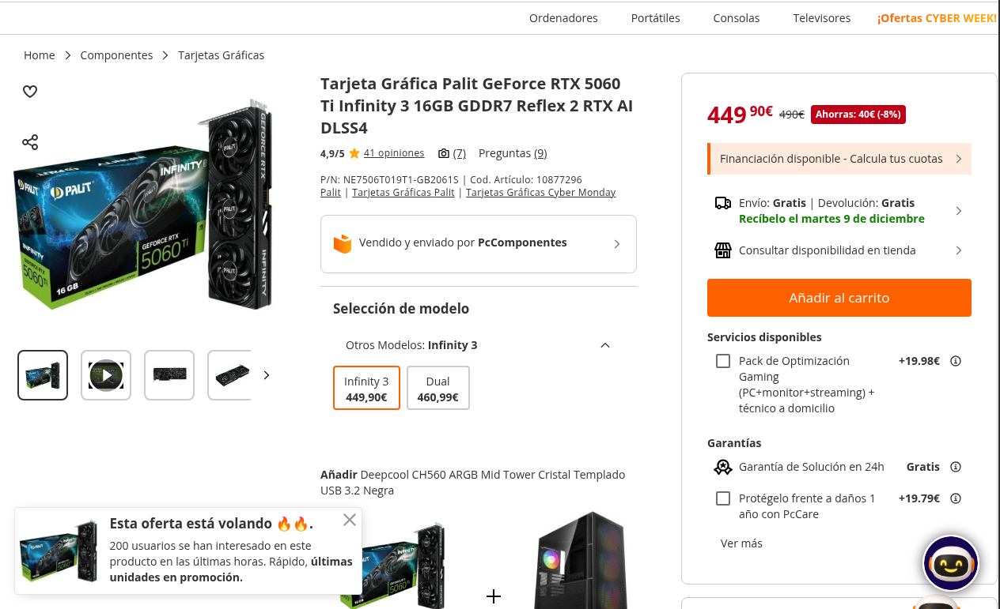
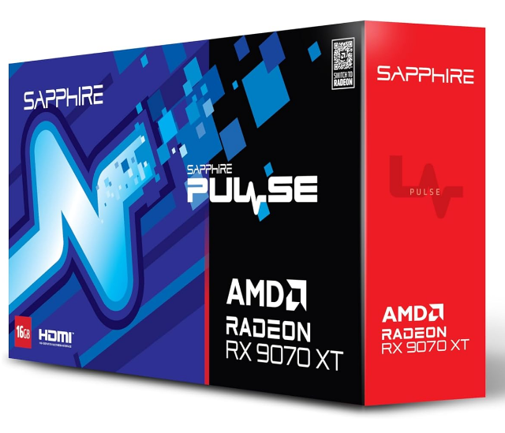
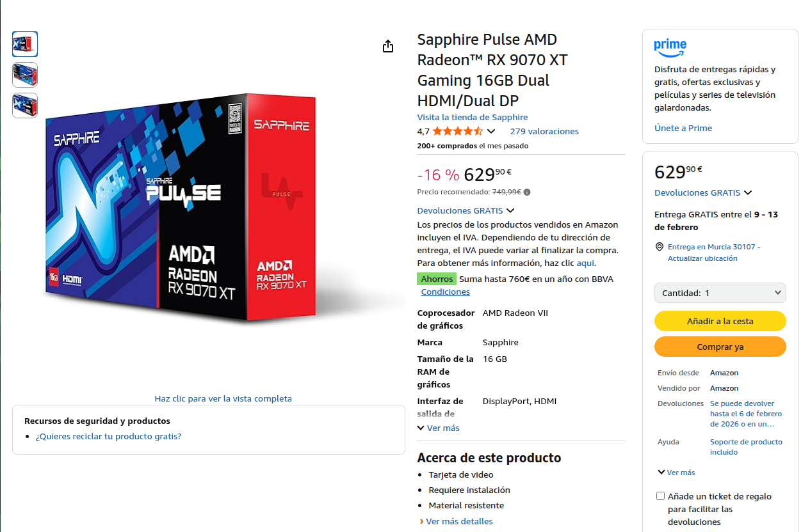
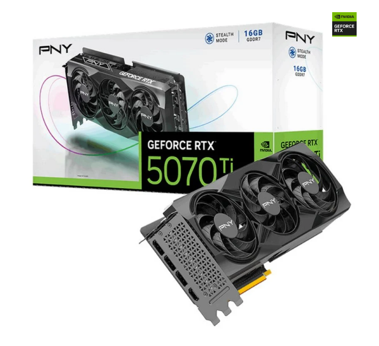
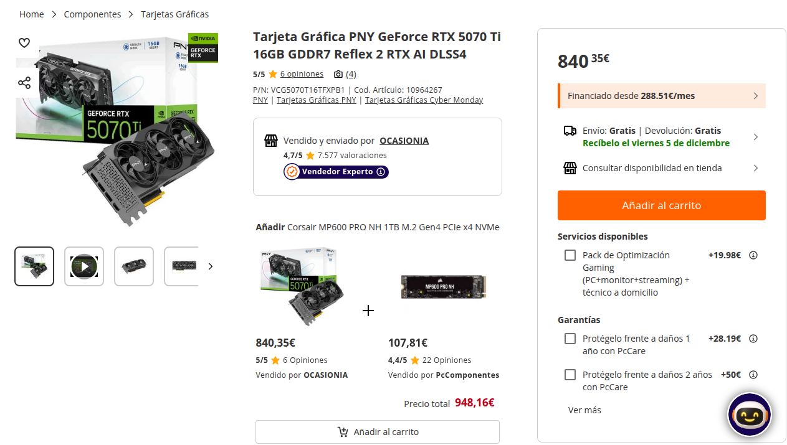

# Parte 3 — GPUs y precios reales (Black Friday 2025)

> Vídeo: **“Mejores Tarjetas Gráficas Calidad - Precio | TOP GPUs GAMING Black Friday 2025”**  
> URL: https://www.youtube.com/watch?v=ILOtkTXLUvg
## 0) Portada
- Alumno/a: _Andrés López_
- Grupo: _ASIR1_
- Fecha: _03/12/2025_

## 1) Introducción (5–10 líneas)
En este vídeo se comparan distintas graficas en distintos rangos de precio. Desde las más asequibles y funcionales, aunque no sean muy recomendadas, hasta las más caras que tienen un precio más bajo por las ofertas. Se comparan dos opciones de GPU por cada rango de precio analizando su rendimiento en videojuegos o si pueden estar enfocadas para IA local. Sobre todo destaca la diferencia de Nvidia y la tecnología de DLSS con las de AMD que no y otros componentes recomendados compatibles con dichas gráficas. Por último, fuera de rangos de precios asequibles, compara los mejores modelos de GPUs de Nvidia, recomendando preferir la RT5070 Ti sobre la 5080, por su calidad-precio.
## 2) Tramos del vídeo y modelos mencionados
### 2.1 Tramo ~350 €
- Minuto inicio–fin: **07:43 – 09:31**
- GPUs citadas (2): **RTX 5060 Ti**, **RX 9060 XT 16GB**

### 2.2 Tramo 600–800 €
- Minuto inicio–fin: **11:36 – 14:07**
- GPUs citadas (2): **RTX 5070 Ti**, **RX 9070 XT**

**¿Se repite algún modelo entre tramos?**: Sí, la RX 9060 XT. Distingue el modelo de 8GB de VRAM y el de 16GB VRAM. El de 8GB es considerablemente más barato que el de 16, y a pesar de ser exactamente el mismo chip y tener un consumo parecido, la diferencia es notoria al jugar en 1440p, por eso recomienda ambas para ajustarse a cada presupuesto.

## 3) Precios reales en tiendas
> Inserta imágenes en `assets/img/30-parte3/` y enlaza con ruta relativa.

### 3.1 GPU del tramo 350 € — Modelo A
- **Tienda:** Amazon
- **Nombre exacto en tienda:** sapphire technology Pulse AMD Radeon RX 9060 XT Gaming OC, 16GB Dual HDMI-DP
- **Precio (€):** 391,96 €
- **URL:** [Amazon 📎](https://www.amazon.es/Sapphire-Pulse-Radeon-9060-16GB/dp/B0F8C6MWSY?crid=2GX4T85GV0KMV&dib=eyJ2IjoiMSJ9.cJ5NUnN7f6IrMNXeSRJtNSo0nUvXx7T4i0tkDIPwtUgwIaxU_N6VT0TwU2436gHBYCcNgUzripkITXdVcFciKfwFxISPL2QYy_EGe0W0lXB4dLRG6rneEv39mrsu5RdW8cFHrj_pT3uoGMpjNsTav0bnH_ycHIiVwASvPvnBk4bvVMhvzSgomLV_2QaIZpOmiHk7Xc_emHzDlPVkiYoshhXnV_dgW0aIIhW6F_3WIimVq2kg4yRN5vpEBYrr6W3ZgEhd25K96XwuN7P2w28zI-Ovxyk-GHuaZxMTlkMsJVg.TVrEKtvp43Q1j7fctbc0U8mYktlOoyUggl2wwACIcC8&dib_tag=se&keywords=rx+9060+xt+16gb&qid=1763066076&sprefix=RX+9060+XT+,aps,71&sr=8-1&ufe=app_do:amzn1.fos.73cb57b4-37b0-490e-9d49-9873e628f7ec&linkCode=sl1&tag=aro013-21&linkId=fb093b31cc3a027b852de7035dac4af3&language=es_ES&ref_=as_li_ss_tl)
- **Imagen:** 
-  

### 3.2 GPU del tramo 350 € — Modelo B
- **Tienda:** PC Componentes
- **Nombre exacto en tienda:** Tarjeta Gráfica Palit GeForce RTX 5060 Ti Infinity 3 16GB GDDR7 Reflex 2 RTX AI DLSS4
- **Precio (€):** 449,90 €
- **URL:** [PC componentes 📎](https://www.pccomponentes.com/tarjeta-grafica-palit-geforce-rtx-5060-ti-infinity-3-16gb-gddr7-reflex-2-rtx-ai-dlss4?utm_source=790799&utm_medium=afi&utm_campaign=www.youtube.com&sv1=affiliate&sv_campaign_id=790799&awc=20982_1764772726_e6824a51ea8b6824f1b4e308e3b409fb&utm_term=deeplink&utm_content=)
- **Imagen:** 
- 

### 3.3 GPU del tramo 600–800 € — Modelo C
- **Tienda:** Amazon
- **Nombre exacto en tienda:** Sapphire Pulse AMD Radeon™ RX 9070 XT Gaming 16GB Dual HDMI/Dual DP
- **Precio (€):** 629,90 €
- **URL:** [Amazon 📎](https://www.amazon.es/Sapphire-Pulse-RadeonTM-9070-Gaming/dp/B0DRPRZMK2?__mk_es_ES=%C3%85M%C3%85%C5%BD%C3%95%C3%91&crid=1XA9HLCUSZ2UT&dib=eyJ2IjoiMSJ9.lfBrQssOzVi6p0HW2BGE9wGNb-Pbt_sJjSmQK9O9h7SvSyWHYy58WZOOuy335Jm9soPYCyeI2JS9A6WJPvxsPH6RZ6TQTco6_mj6QTCuPTxjASu5-pr-EaebliddYCOZhTF5_G7ZKepO57e6hnCUZ8ruzILtomoVhuXgam1nqw5oUxuQJ9RwqTXOY0r4VOEPftaGV7YuPPk0OVcbHpmXR80eCGa8lZ5aMpkcCyG8foYEHNzeVYJKGnJNMfehtf7cNtTbICgSn6f76328VO9Eyr1P1Q0iuLEJzPb60m9GLn8.2i4Q5-NuSstIue_Hoqmpk_7D0V3lCUEiaUkC3JhCGYk&dib_tag=se&keywords=rx+970+xt&qid=1763066190&sprefix=rx+9070+xt,aps,75&sr=8-1&ufe=app_do:amzn1.fos.36393ef6-f0da-44a9-8c13-668db228262a&linkCode=sl1&tag=aro013-21&linkId=f67a28719172d86e307369cf96d7aa0b&language=es_ES&ref_=as_li_ss_tl)
- **Imagen:** 
 - 

### 3.4 GPU del tramo 600–800 € — Modelo D
- **Tienda:** PC Componentes
- **Nombre exacto en tienda:** Tarjeta Gráfica PNY GeForce RTX 5070 Ti 16GB GDDR7 Reflex 2 RTX AI DLSS4
- **Precio (€):** 840,35€
- **URL:** [PC Componentes 📎](https://www.pccomponentes.com/tarjeta-grafica-pny-geforce-rtx-5070-ti-16gb-gddr7-reflex-2-rtx-ai-dlss4?utm_source=790799&utm_medium=afi&utm_campaign=www.youtube.com&sv1=affiliate&sv_campaign_id=790799&awc=20982_1764772330_b3e6b068e4ce93b366fe23dd5707c08a&utm_term=deeplink&utm_content=)
- **Imagen:** 
- 

> Nota: Si no encuentras el mismo **ensamblador**, indica la diferencia manteniendo la misma **GPU**.

## 4) Tabla comparativa (precios reales)
| Tramo (vídeo) | GPU (modelo del vídeo)          | Tienda         | Precio (€) | URL                                                                                                                                                                                                                              | Imagen                                                   |
| ------------- | ------------------------------- | -------------- | ---------: | -------------------------------------------------------------------------------------------------------------------------------------------------------------------------------------------------------------------------------- | -------------------------------------------------------- |
| 350 €         | AMD Radeon RX 9060 XT 16GB VRAM | Amazon         |    391,96€ | [📎](https://www.amazon.es/Sapphire-Pulse-Radeon-9060-16GB/dp/B0F8C6MWSY?sr=8-1&language=es_ES)                                                                                                                                  |  |
| 350 €         | GeForce RTX 5060 Ti             | PC Componentes |    449,90€ | [📎](https://www.pccomponentes.com/tarjeta-grafica-palit-geforce-rtx-5060-ti-infinity-3-16gb-gddr7-reflex-2-rtx-ai-dlss4?sv1=affiliate&sv_campaign_id=790799&awc=20982_1764772726_e6824a51ea8b6824f1b4e308e3b409fb&utm_content=) |  |
| 600–800 €     | AMD Radeon™ RX 9070 XT          | Amazon         |    629,90€ | [📎](https://www.amazon.es/Sapphire-Pulse-RadeonTM-9070-Gaming/dp/B0DRPRZMK2?__mk_es_ES=%C3%85M%C3%85%C5%BD%C3%95%C3%91&sr=8-1&language=es_ES)                                                                                   |  |
| 600–800 €     | GeForce RTX 5070 Ti             | PC Componentes |    840,35€ | [📎](https://www.pccomponentes.com/tarjeta-grafica-pny-geforce-rtx-5070-ti-16gb-gddr7-reflex-2-rtx-ai-dlss4?sv1=affiliate&sv_campaign_id=790799&awc=20982_1764772330_b3e6b068e4ce93b366fe23dd5707c08a&utm_content=)              |  |

## 5) Conclusión (5–8 líneas)
- ¿Los precios reales se parecen a lo que sugiere el vídeo?
	Sí, los precios estan rondando el margen que propone el video. Pero varían dependiendo de las ofertas de blackfriday. Tambien cambia dependiendo de la tienda entoces cada gráfica individualmente se encuentra dentro de su propio margen.
	
- ¿Cuál de las cuatro ofrece mejor **calidad-precio** y por qué?
	La RX 9070 XT es una de las mejores del video calidad-precio. Con un coste medio-alto para ordenadores de esa gama. Ofrece un buen rendimiento sin necesidad de tecnologías de Nvidia.
	
- Observaciones finales.
	Las recomendaciones se adaptan bien a cada presupuesto, diferenciándose claramente entre Nvidia y AMD, mientras que Intel se queda para la gama baja. Se destaca la VRAM en cada modelo, buscando el equilibrio entre 8GB y más de 12GB. Los ejemplos de rendimiento en juegos ayudan a ver como rinden con un uso real de gaming o IA.

## 6) Fuentes
###### Tiendas:
- [GPU A](https://www.amazon.es/Sapphire-Pulse-Radeon-9060-16GB/dp/B0F8C6MWSY?sr=8-1&language=es_ES)
- [GPU B](https://www.pccomponentes.com/tarjeta-grafica-palit-geforce-rtx-5060-ti-infinity-3-16gb-gddr7-reflex-2-rtx-ai-dlss4?sv1=affiliate&sv_campaign_id=790799&awc=20982_1764772726_e6824a51ea8b6824f1b4e308e3b409fb&utm_content=)
- [GPU C](https://www.amazon.es/Sapphire-Pulse-RadeonTM-9070-Gaming/dp/B0DRPRZMK2?__mk_es_ES=%C3%85M%C3%85%C5%BD%C3%95%C3%91&sr=8-1&language=es_ES)
- [GPU D](https://www.pccomponentes.com/tarjeta-grafica-pny-geforce-rtx-5070-ti-16gb-gddr7-reflex-2-rtx-ai-dlss4?sv1=affiliate&sv_campaign_id=790799&awc=20982_1764772330_b3e6b068e4ce93b366fe23dd5707c08a&utm_content=)
###### Vídeo:
- [YouTube](https://www.youtube.com/watch?v=ILOtkTXLUvg)
