# Reto 03 — Elementos internos de un sistema informático (UT2 · RA1)

**Alumno/a:** López Muñoz, Andrés Tahoe
**Grupo:**  1º ASIR
**Fecha:**  11/11/25
**Repositorio:** [GitHub](https://github.com/andrestlm/Proyecto_RA1_UT2)

---
# Índice

1. [Portada](00-portada.md)
2. [Introducción](02-introduccion.md)
3. Parte 1 — Fuentes y Refrigeración  
   - [`10-parte1_fuentes_y_refrigeracion/tu_parte1.md`](retos/Reto_03_Elementos_Internos_SI/docs/10-parte1_fuentes_y_refrigeracion/parte1_fuentes_y_refrigeracion.md)
1. Parte 2 — Componentes y DDR5  
   - [`20-parte2/parte2_componentes.md`](retos/Reto_03_Elementos_Internos_SI/docs/20-parte2_ram_y_cpu/parte2_comparacion_componentes.md)
1. Parte 3 — GPUs Black Friday  
   - [`30-parte3/parte3_gpus_blackfriday.md`](retos/Reto_03_Elementos_Internos_SI/docs/30-parte3_gpu/parte3_gpus_blackfriday.md)
1. [ENTREGA ÚNICA](90-ENTREGA_UNICA.md)
2. [Checklist](99-entrega_y_checklist.md)
---
# Introducción

En este reto nos centramos en **elementos internos** clave: alimentación, refrigeración, **RAM**, **microprocesador** y **GPU**.

- **Fuentes de alimentación:** formatos (ATX, SFX, TFX), eficiencia 80 PLUS, modularidad, PFC y dimensiones.
- **Refrigeración de CPU:** contraste entre soluciones **líquidas AIO** y **pasivas** para una **misma CPU**, evaluando eficiencia, ruido y coste.
- **RAM:** tipos (DDR3, DDR4, DDR5), frecuencias, latencias, canales (single/dual/quad channel), perfiles XMP/EXPO y su impacto en el rendimiento.
- **Microprocesador:** arquitectura, número de núcleos e hilos, frecuencias base y turbo, caché, litografía, TDP y compatibilidad con el chipset y el socket de la placa base.
- **GPUs en black friday:** analizamos **GPUs** comparando las recomendaciones de un vídeo con **precios reales** de tiendas

 El resultado final se consolida en un **PDF único**.

---
## Parte 1 — Actividades A y B

# Parte 1 — Actividades A y B (único archivo)

---
## Actividad A — Investigación de **Fuentes de Alimentación** 

**Instrucciones:**
1. Elige **3 tiendas online españolas/especializadas** (p. ej., PcComponentes, Amazon ES, LDLC ES).
2. En **cada tienda**, selecciona **un modelo ATX**, **uno SFX** y **uno TFX** (total 9).
3. Para cada modelo, recoge: **Marca/Modelo**, **Potencia (W)**, **Certificación 80 PLUS**, **Precio (€)**, **Modularidad**, **PFC (activo/pasivo)**, **Dimensiones (mm)**, **Enlace**.
4. Al final, incluye una **tabla resumen comparativa global**.

### Tienda 1: [PC Componentes](https://www.pccomponentes.com/) 

| Tipo | Marca/Modelo           | Potencia (W) | 80 PLUS  | Precio (€) | Modularidad | PFC    | Dimensiones (L×W×H mm) | Enlace                                                                                                                             |
| ---- | ---------------------- | ------------ | -------- | ---------: | ----------- | ------ | ---------------------- | ---------------------------------------------------------------------------------------------------------------------------------- |
| ATX  | Corsair CX650          | 650          | Bronze   |     59,99€ | No          | Activo | 140x150x86             | [📎](https://www.pccomponentes.com/corsair-cx650-650-w-80-plus-bronze)                                                             |
| SFX  | ASUS ROG Loki SFX-L    | 1000         | Platinum |    241,24€ | Sí          | Activo | 125x125x63.5           | [📎](https://www.pccomponentes.com/asus-rog-loki-sfx-l-1000w-80-plus-platinum-modular)                                             |
| TFX  | Tacens Anima Aptii500p | 500          | No       |     22,64€ | No          | Activo | 150x85x65              | [📎](https://www.pccomponentes.com/tacens-anima-aptii500p-fuente-alimentacion-tfx-500w-ultracompacta-85-smd-ventilador-80mm-negro) |

**Notas/criterios de la tienda 1:** PC Componentes cuenta con muchas fuentes ATX, incluyendo su marca propia "Tempest", la mayoría orientadas a gaming. Pero fuentes TFX cuenta con muy pocas, siendo muy genéricas.

### Tienda 2: [Coolmod](https://www.coolmod.com/)

| Tipo | Marca/Modelo          | Potencia (W) | 80 PLUS | Precio (€) | Modularidad | PFC    | Dimensiones (L×W×H mm) | Enlace                                                                                                                                                                                                                    |
| ---- | --------------------- | ------------ | ------- | ---------: | ----------- | ------ | ---------------------- | ------------------------------------------------------------------------------------------------------------------------------------------------------------------------------------------------------------------------- |
| ATX  | DeepCool PN850D       | 850          | Gold    |    139,95€ | No          | Activo | 140x150x86             | [📎](https://www.coolmod.com/deepcool-pn850d-80-plus-gold-850w-atx-3-1-pcie-5-1/?_gl=1*685b55*_up*MQ..*_gs*MQ..&gclid=EAIaIQobChMIjsqv7afqkAMVz8p5BB0pegs9EAAYASAAEgI68fD_BwE&gbraid=0AAAAAD_BC_PUCflhN-SQxSRmMDeZrsYgg)  |
| SFX  | Lian Li SP750         | 750          | Gold    |    138,94€ | Sí          | Activo | 100x125x63.5           | [📎](https://www.coolmod.com/lian-li-sp750-sfx-80-plus-gold-750w-modular-blanco/?_gl=1*1ilsahj*_up*MQ..*_gs*MQ..&gclid=EAIaIQobChMIjsqv7afqkAMVz8p5BB0pegs9EAAYASAAEgI68fD_BwE&gbraid=0AAAAAD_BC_PUCflhN-SQxSRmMDeZrsYgg) |
| TFX  | Coolbox Basic 500GR-T | 500          | No      |     18,95€ | No          | Pasivo | 175x85x65              | [📎](https://www.coolmod.com/deepcool-pn850d-80-plus-gold-850w-atx-3-1-pcie-5-1/?_gl=1*685b55*_up*MQ..*_gs*MQ..&gclid=EAIaIQobChMIjsqv7afqkAMVz8p5BB0pegs9EAAYASAAEgI68fD_BwE&gbraid=0AAAAAD_BC_PUCflhN-SQxSRmMDeZrsYgg)  |

**Notas/criterios de la tienda 2:** Coolmod también tiene bastante variedad en ATX para  multitud de presupuestos y potencias, pero en cuento a SFX y TFX tienen muy pocas alternativas.

### Tienda 3: [LDLC](https://www.ldlc.com/)

| Tipo | Marca/Modelo          | Potencia (W) | 80 PLUS  | Precio (€) | Modularidad | PFC    | Dimensiones (L×W×H mm) | Enlace                                                 |
| ---- | --------------------- | ------------ | -------- | ---------: | ----------- | ------ | ---------------------- | ------------------------------------------------------ |
| ATX  | ASUS Pro Workstation  | 3000         | Platinum |    809,95€ | Sí          | Activo | 175x150x86             | [📎](https://www.ldlc.com/es-es/ficha/PB00705581.html) |
| SFX  | Thermalright TGFX-750 | 750          | Gold     |    111,95€ | Sí          | Activo | 100x125x63.5           | [📎](https://www.ldlc.com/es-es/ficha/PB00674006.html) |
| TFX  | be quiet! TFX Power 3 | 300          | Gold     |     76,95€ | No          | Activo | 175x85x65              | [📎](https://www.ldlc.com/es-es/ficha/PB00430598.html) |

**Notas/criterios de la tienda 3:** En LDLC encuentras variedad más allá que solo "gaming", por ejemplo, venden fuentes para Workstation de 3000W, que es un producto para un entorno más profesional. Además, por esa razón, tambien tiene más opciones para SFX y TFX.

#### Tabla **resumen comparativa** (global, 9 modelos)
| Tienda         | Tipo | Marca/Modelo           | Potencia (W) | 80 PLUS  | Precio (€) | Modularidad | PFC    | Dimensiones (mm) | Observaciones (enlace)                                                                                                                                                                                                    |
| -------------- | ---- | ---------------------- | ------------ | -------- | ---------: | ----------- | ------ | ---------------- | ------------------------------------------------------------------------------------------------------------------------------------------------------------------------------------------------------------------------- |
| PC Componentes | ATX  | Corsair CX650          | 650          | Bronze   |     59,99€ | No          | Activo | 140x150x86       | [📎](https://www.pccomponentes.com/corsair-cx650-650-w-80-plus-bronze)                                                                                                                                                    |
| PC Componentes | SFX  | ASUS ROG Loki SFX-L    | 1000         | Platinum |    241,24€ | Sí          | Activo | 125x125x63.5     | [📎](https://www.pccomponentes.com/asus-rog-loki-sfx-l-1000w-80-plus-platinum-modular)                                                                                                                                    |
| PC Componentes | TFX  | Tacens Anima Aptii500p | 500          | No       |     22,64€ | No          | Activo | 150x85x65        | [📎](https://www.pccomponentes.com/tacens-anima-aptii500p-fuente-alimentacion-tfx-500w-ultracompacta-85-smd-ventilador-80mm-negro)                                                                                        |
| Coolmod        | ATX  | DeepCool PN850D        | 850          | Gold     |    139,95€ | No          | Activo | 140x150x86       | [📎](https://www.coolmod.com/deepcool-pn850d-80-plus-gold-850w-atx-3-1-pcie-5-1/?_gl=1*685b55*_up*MQ..*_gs*MQ..&gclid=EAIaIQobChMIjsqv7afqkAMVz8p5BB0pegs9EAAYASAAEgI68fD_BwE&gbraid=0AAAAAD_BC_PUCflhN-SQxSRmMDeZrsYgg)  |
| Coolmod        | SFX  | Lian Li SP750          | 750          | Gold     |    138,94€ | Sí          | Activo | 100x125x63.5     | [📎](https://www.coolmod.com/lian-li-sp750-sfx-80-plus-gold-750w-modular-blanco/?_gl=1*1ilsahj*_up*MQ..*_gs*MQ..&gclid=EAIaIQobChMIjsqv7afqkAMVz8p5BB0pegs9EAAYASAAEgI68fD_BwE&gbraid=0AAAAAD_BC_PUCflhN-SQxSRmMDeZrsYgg) |
| Coolmod        | TFX  | Coolbox Basic 500GR-T  | 500          | No       |     18,95€ | No          | Pasivo | 175x85x65        | [📎](https://www.coolmod.com/deepcool-pn850d-80-plus-gold-850w-atx-3-1-pcie-5-1/?_gl=1*685b55*_up*MQ..*_gs*MQ..&gclid=EAIaIQobChMIjsqv7afqkAMVz8p5BB0pegs9EAAYASAAEgI68fD_BwE&gbraid=0AAAAAD_BC_PUCflhN-SQxSRmMDeZrsYgg)  |
| LDLC           | ATX  | ASUS Pro Workstation   | 3000         | Platinum |    809,95€ | Sí          | Activo | 175x150x86       | [📎](https://www.ldlc.com/es-es/ficha/PB00705581.html)                                                                                                                                                                    |
| LDLC           | SFX  | Thermalright TGFX-750  | 750          | Gold     |    111,95€ | Sí          | Activo | 100x125x63.5     | [📎](https://www.ldlc.com/es-es/ficha/PB00674006.html)                                                                                                                                                                    |
| LDLC           | TFX  | be quiet! TFX Power 3  | 300          | Gold     |     76,95€ | No          | Activo | 175x85x65        | [📎](https://www.ldlc.com/es-es/ficha/PB00430598.html)                                                                                                                                                                    |

---
## Actividad B — **Refrigeración para la MISMA CPU** (Líquida vs Aire)

**Instrucciones:**
1. Elige una **CPU concreta** (ej.: Intel Core i9-13900, AMD Ryzen 9 7950X…). Indícala abajo.
2. Enfrenta **líquida** vs **aire** (precio, eficiencia térmica, ruido, extras). Incluye **URLs**.
3. Conclusión por perfil (gamer, diseñador, usuario estándar).

**CPU elegida:** AMD Ryzen 5 7600X

### Modelos evaluados
| Tipo          | Marca/Modelo               | Precio (€) | TDP soportado / Rendimiento térmico | Ruido (dBA) | Dimensiones (mm) | Sockets                 | Mantenimiento                                                      | Garantía | Enlace                                                                                                                                                                                              |
| ------------- | -------------------------- | ---------: | ----------------------------------- | ----------- | ---------------- | ----------------------- | ------------------------------------------------------------------ | -------- | --------------------------------------------------------------------------------------------------------------------------------------------------------------------------------------------------- |
| Líquida (AIO) | ASUS ROG Ryuo III 360 ARGB |    275,00€ | 350W                                | 36.45       | 120x120x25       | AM5 (y los más comunes) | Limpieza radiador, ventiladores y bomba y cambio de pasta térmica. | 6 años   | [📎](https://rog.asus.com/es/cooling/cpu-liquid-coolers/rog-ryuo/rog-ryuo-iii-360-argb-model/)[📎](https://www.amazon.es/dp/B0BJJQRDBN/?smid=A1G0P08WHNB98J&creative=24634&creativeASIN=B0BJJQRDBN) |
| Aire          | DeepCool AG620 BK ARGB     |     92,58€ | 260W                                | 29,4        | 120 x 120 x 25   | AM5 (y los más comunes) | Limpieza del disipador y ventilador y cambio de pasta térmica      | 6 años   | [📎](https://es.deepcool.com/support/Base/index.shtml?id=Warranty)[📎](https://www.pccomponentes.com/deepcool-ag620-bk-argb-ventilador-cpu-120mm-negro)                                             |

#### Líquida

#### Aire
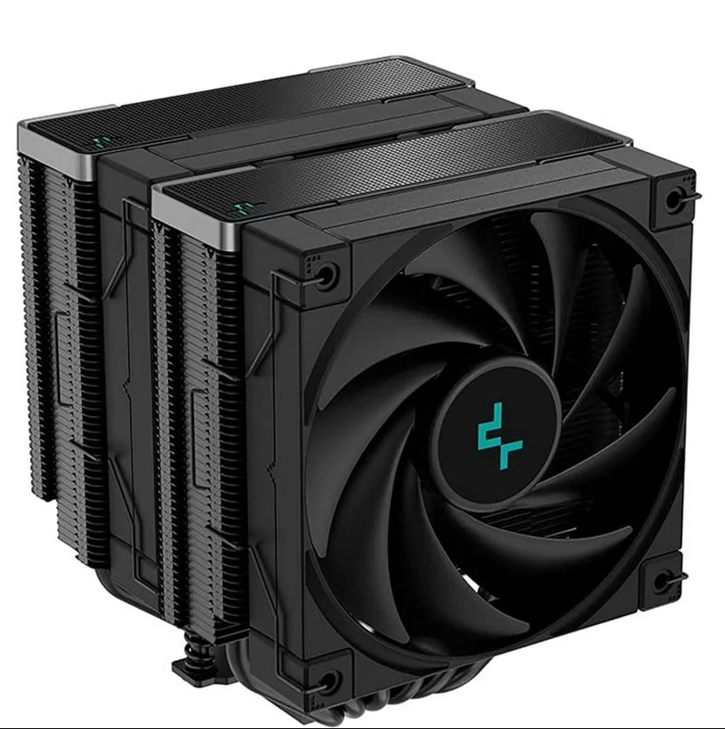
### Análisis y elección por perfil
- **Gamer:**  Para jugar a videojuegos, se le requiere más exigencia a la CPU para poder jugar con un framerate estable. Esto genera muchísimo calor y lo mejor es usar una refrigeración liquida que disipe todo ese calor.
- **Profesional de diseño/simulación:**  Para realizar trabajos de diseño y simulación se le exige a la CPU mucha potencia de cálculo para simular situaciones o para usar software de diseño exigentes. Por tanto, hay que usar una refrigeración liquida que pueda mantener temperaturas bajas.
- **Usuario estándar/ofimática:**  Este tipo de usuarios no se les requiere mucha potencia en la CPU, ya que los programas de ofimática o navegadores web no calientan demasiado el PC. Por tanto en este caso, se pueden usar disipadores de aire, que requieren menos mantenimiento y son más silenciosos.

### Conclusión general

La refrigeración líquida es la mejor opción si quieres usar toda la potencia de la CPU, como gamers o profesionales que quieren que el procesador se mantenga frio mucho estrés. Esta opción ofrece más disipación del calor y por tanto, la CPU no tenga problemas de temperatura, aunque suelen costar más y requieren mantenimiento. Por otro lado, el disipador de aire es para para tareas menos demandantes de CPU y para no tener que hacerle tanto mantenimiento, aunque no es tan efectivo si vas a usar algo mas demandante y limita un poco el rendimiento. Entonces para usar la potencia máxima del CPU y estabilidad en temperaturas, mejor la líquida. Si prefieres simplicidad para tareas simples, el disipador de aire es una opción. La elección depende del usuario del ordenador y de las tareas que haga en el ordenador.

---
## Parte 2 — Componentes
# Parte 2 — Selección y comparación de componentes

---
> **Instrucciones generales**  
> 1) **Todo en este único archivo**.  
> 2) Las capturas guárdalas en `assets/img/20-parte2/` y enlázalas con ruta relativa.  
> 3) Cita **URL** de cada ficha y justifica la elección según **oficina** o **gaming**.  
## 1) Búsqueda de componentes (tienda online)
Tienda: PC Componentes
### 1.1 Memoria RAM — PC de oficina
| Campo                                         | Valor                                                                                                                                                                                                                                                                                                                                                                        |
| --------------------------------------------- | ---------------------------------------------------------------------------------------------------------------------------------------------------------------------------------------------------------------------------------------------------------------------------------------------------------------------------------------------------------------------------- |
| **Marca y modelo**                            | Crucial CT16G4DFRA32A                                                                                                                                                                                                                                                                                                                                                        |
| **Capacidad**                                 | 16 GB                                                                                                                                                                                                                                                                                                                                                                        |
| **Velocidad / Timings**                       | 3200Mhz                                                                                                                                                                                                                                                                                                                                                                      |
| **Tipo (DDR4/DDR5) y formato (DIMM/SO-DIMM)** | DDR4, DIMM                                                                                                                                                                                                                                                                                                                                                                   |
| **Precio (€)**                                | 96,99€ 💀 (26/11/25)                                                                                                                                                                                                                                                                                                                                                         |
| **URL**                                       | [URL 📎](https://www.pccomponentes.com/crucial-ct16g4dfra32a-ddr4-3200mhz-pc4-25600-16gb-cl22 "Enlace")                                                                                                                                                                                                                                                                      |
| **Captura**                                   | 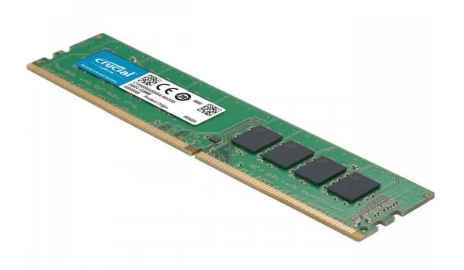 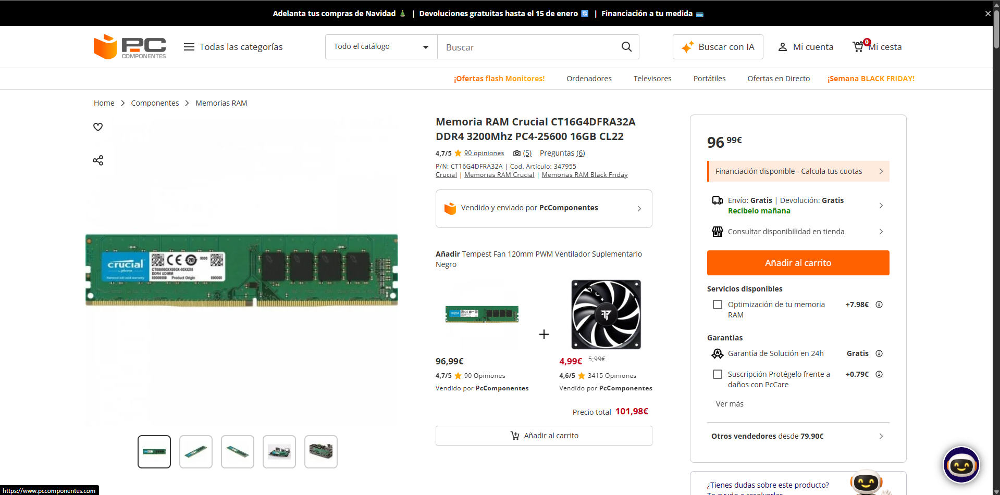                                                                                                                                                                                                        |
| **Justificación**                             | Para trabajos de ofimática o no muy demandantes, una RAM de 16GB de RAM DDR4 a 3200Mhz es lo más recomendado calidad-precio, aunque se puede usar memorias más lentas. En este caso, los 16GB no estan en dual channel, pero es conveniente que sean 2 del mismo tamaño. Sin embargo, por la reserva de stock de RAM, los precios se han visto incrementados más de un 100%. |

### 1.2 Memoria RAM — PC gaming
| Campo                              | Valor                                                                                                                                                                                                                                                                                                                                                                                                                                                                                                                                                                                              |
| ---------------------------------- | -------------------------------------------------------------------------------------------------------------------------------------------------------------------------------------------------------------------------------------------------------------------------------------------------------------------------------------------------------------------------------------------------------------------------------------------------------------------------------------------------------------------------------------------------------------------------------------------------- |
| **Marca y modelo**                 | Kingston FURY Beast RGB EXPO Kit                                                                                                                                                                                                                                                                                                                                                                                                                                                                                                                                                                   |
| **Capacidad**                      | 2x32GB                                                                                                                                                                                                                                                                                                                                                                                                                                                                                                                                                                                             |
| **Velocidad / Timings / XMP-EXPO** | 6000MT/s, CAS: CL30, AMD EXPO 1.0                                                                                                                                                                                                                                                                                                                                                                                                                                                                                                                                                                  |
| **Tipo (DDR4/DDR5)**               | DDR5                                                                                                                                                                                                                                                                                                                                                                                                                                                                                                                                                                                               |
| **Precio (€)**                     | 571,99€ (~~699,99€~~) 💀 (26/11/25)                                                                                                                                                                                                                                                                                                                                                                                                                                                                                                                                                                |
| **URL**                            | [URL 📎](https://www.pccomponentes.com/memoria-ram-kingston-64gb-ddr5-6000mt-s-fury-beast-rgb-expo-kit-2x32gb "Enlace")                                                                                                                                                                                                                                                                                                                                                                                                                                                                            |
| **Captura**                        | 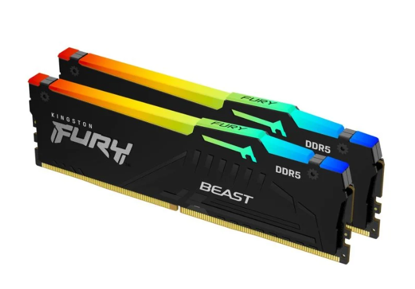 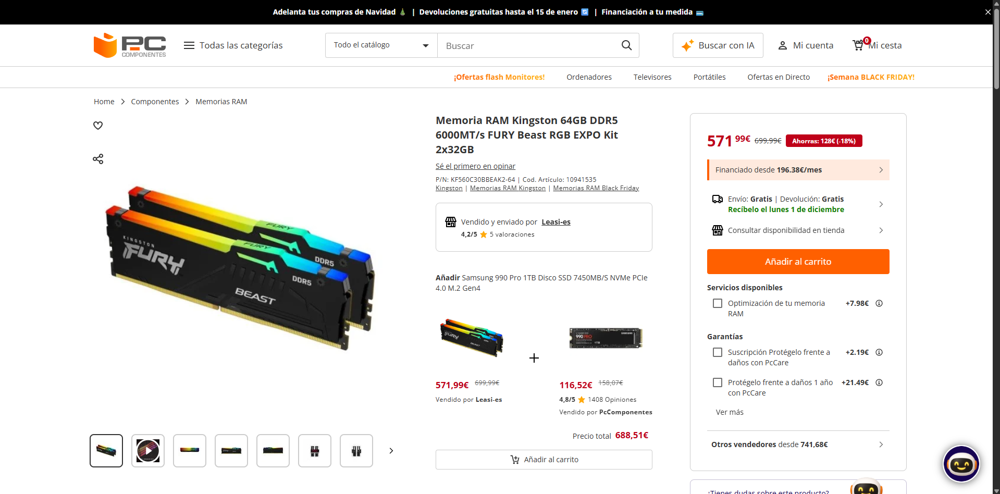                                                                                                                                                                                                                                                                                                                                                                                                                                          |
| **Justificación**                  | Para jugar a videojuegos que sean demandantes es importante tener una RAM con suficiente almacenamiento y velocidades altas, usando la RAM en dual channel para aumentar aun más la transferencia de datos. También es importante que la RAM tenga un recubrimiento metálico para disipar mejor el calor de forma pasiva. En este caso, la RAM tiene luces para mejorar la armonía estética si se monta un pc ya sea de colores simples o multicolor, acentuando aun más la forma de la RAM. Una RAM de estas características permite hacerle overclock para aumentar las velocidades incluso más. |

### 1.3 Microprocesador — PC de oficina
| Campo                        | Valor                                                                                                                                                                                                                                                                                                                                                                                                                                                                                                       |
| ---------------------------- | ----------------------------------------------------------------------------------------------------------------------------------------------------------------------------------------------------------------------------------------------------------------------------------------------------------------------------------------------------------------------------------------------------------------------------------------------------------------------------------------------------------- |
| **Marca y modelo**           | AMD Ryzen 5 8600G                                                                                                                                                                                                                                                                                                                                                                                                                                                                                           |
| **Núcleos / Hilos**          | 6 núcleos, 12 hilos                                                                                                                                                                                                                                                                                                                                                                                                                                                                                         |
| **Frecuencias (base/boost)** | 4,3 GHz/5,0 GHz                                                                                                                                                                                                                                                                                                                                                                                                                                                                                             |
| **Gráficos integrados**      | Sí, AMD Radeon™ 760M                                                                                                                                                                                                                                                                                                                                                                                                                                                                                        |
| **TDP / Consumo**            | 65W (configurable entre 45-65W)                                                                                                                                                                                                                                                                                                                                                                                                                                                                             |
| **Precio (€)**               | 169,90€ (~~206,95€~~) 26/11/25                                                                                                                                                                                                                                                                                                                                                                                                                                                                              |
| **Socket / Compatibilidad**  | AM5                                                                                                                                                                                                                                                                                                                                                                                                                                                                                                         |
| **URL**                      | [URL 📎](https://www.pccomponentes.com/procesador-amd-ryzen-5-8600g-ia-integrada-43-5ghz-box "Enlace")                                                                                                                                                                                                                                                                                                                                                                                                      |
| **Captura**                  | 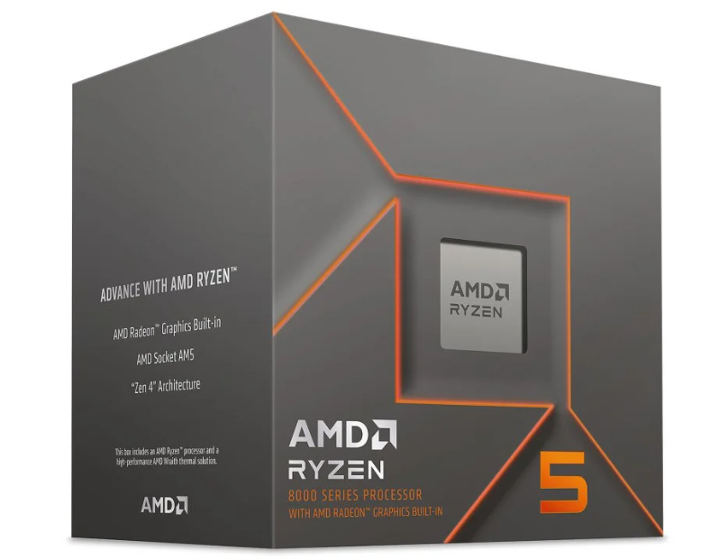 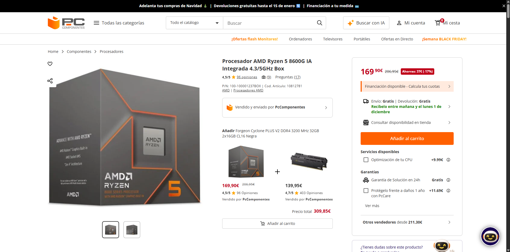                                                                                                                                                                                                                                                                                                                                               |
| **Justificación**            | Para un ordenador de oficina que no use programas muy demandantes, como de ofimática, no hace falta una CPU muy potente. Lo mejor es que consuma poco y no genere mucho calor y por ende, ruido. Para ahorrar en el presupuesto o para evitar problemas, es recomendable que tenga graficos integrados como es el caso, que no dan mas rendimiento pero quita la necesidad de tener una grafica. Si hay que mejorarlo o cambiar la CPU, esta con socket AM5 da mucha compatibilidad con otros procesadores. |

### 1.4 Microprocesador — PC gaming
| Campo                        | Valor                                                                                                                                                                                                                                                                                                                                                                                                                                                                                                 |
| ---------------------------- | ----------------------------------------------------------------------------------------------------------------------------------------------------------------------------------------------------------------------------------------------------------------------------------------------------------------------------------------------------------------------------------------------------------------------------------------------------------------------------------------------------- |
| **Marca y modelo**           | AMD Ryzen 9 9950X3D                                                                                                                                                                                                                                                                                                                                                                                                                                                                                   |
| **Núcleos / Hilos**          | 16 núcleos, 32 hilos                                                                                                                                                                                                                                                                                                                                                                                                                                                                                  |
| **Frecuencias (base/boost)** | Base: 4,3 GHz, turbo: 5,7 GHz                                                                                                                                                                                                                                                                                                                                                                                                                                                                         |
| **Caché**                    | 144 MB                                                                                                                                                                                                                                                                                                                                                                                                                                                                                                |
| **TDP / Consumo**            | 170W                                                                                                                                                                                                                                                                                                                                                                                                                                                                                                  |
| **Precio (€)**               | 669,90€ (~~847,40€~~) 26/11/25                                                                                                                                                                                                                                                                                                                                                                                                                                                                        |
| **Socket / Compatibilidad**  | AM5                                                                                                                                                                                                                                                                                                                                                                                                                                                                                                   |
| **URL**                      | [URL 📎](https://www.pccomponentes.com/procesador-amd-ryzen-9-9950x3d-43-57ghz-box "Enlace")                                                                                                                                                                                                                                                                                                                                                                                                          |
| **Captura**                  | 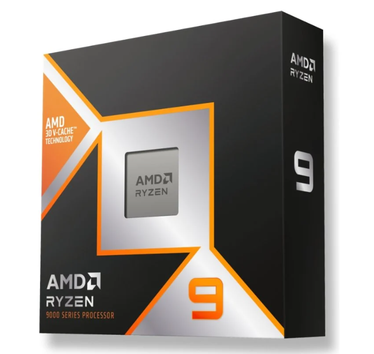 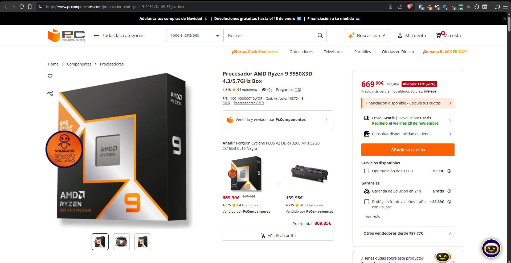                                                                                                                                                                                                                                                                                                                                             |
| **Justificación**            | Para juegos y tareas demandante es necesario tener una CPU potente, que pueda hacerse overclock para aprovechar todo el rendimiento. Hay que tener en cuenta que la combinación con la tarjeta grafica sea buena y no tenga cuello de botella, porque si no estaríamos desperdiciando recursos. Por tanto si la CPU no tiene graficos integrados se aprovechara más. Tambien hay que combinarlo con una refrigeración bastante decente para que no suban las temperaturas y no se pierda rendimiento. |

---
## 2) Tabla comparativa — Tipos de RAM encontrados
Compara **al menos DDR4 vs DDR5**. 
*(He cambiado la disposición de columnas para poder añadir más características ajustando el espacio)*

| **Característica**            | **DDR4**                                                                                                                                                 | **DDR5**                                                                                                                        |
| ----------------------------- | -------------------------------------------------------------------------------------------------------------------------------------------------------- | ------------------------------------------------------------------------------------------------------------------------------- |
| **Velocidad típica (MT/s)**   | 3200 MT/s                                                                                                                                                | 6400 MT/s                                                                                                                       |
| **Voltaje típico**            | 1.2 V                                                                                                                                                    | 1.1 V                                                                                                                           |
| **Consumo / eficiencia**      | No muy eficiente, pero es estable.                                                                                                                       | Más eficiente y se puede regular el voltaje.                                                                                    |
| **Precio por GB (aprox.)**    | 5 €/GB                                                                                                                                                   | 11 €/GB                                                                                                                         |
| **Compatibilidad con placas** | Intel: 6ª–13ª gen. AMD: AM4                                                                                                                              | Intel: 12ª–14ª gen. AMD: AM5                                                                                                    |
| **Latencia**                  | ~ 14ns                                                                                                                                                   | ~ 15ns                                                                                                                          |
| **Uso ideal**                 | Ejecutar tareas que no exijan mucho rendimiento como navegar por internet, transcribir documentos o ejecutar aplicaciones que requieran memoria moderada | Tareas que requieren máximo rendimiento como juegos exigentes, edición de material audiovisual o ejecución de programas pesados |
| **Observaciones**             | No es tan cara, ideal para presupuestos bajos o medios. No es compatible con DDR5.                                                                       | Tiene más ancho de banda, mayor potencial de OC. Requiere placa DDR5. Más latencia pero mayor velocidad.                        |
> Referencia rápida: documenta **placas base compatibles** y si tu CPU escogida admite el tipo de RAM:
> En mi caso, las dos CPUs escogidas tienen un socket AM5, y una buena placa base con este socket y compatible con memoria RAM DDR5 seria la placa base [ASUS PRIME B850M-A](https://www.pccomponentes.com/placa-base-asus-prime-b850m-a-wifi-am5-micro-atx-ddr5-wi-fi-6e-25gbe-lan), porque como su socket es el AM5, van a ser compatibles con DDR5.

*Comparativa ancho de banda*
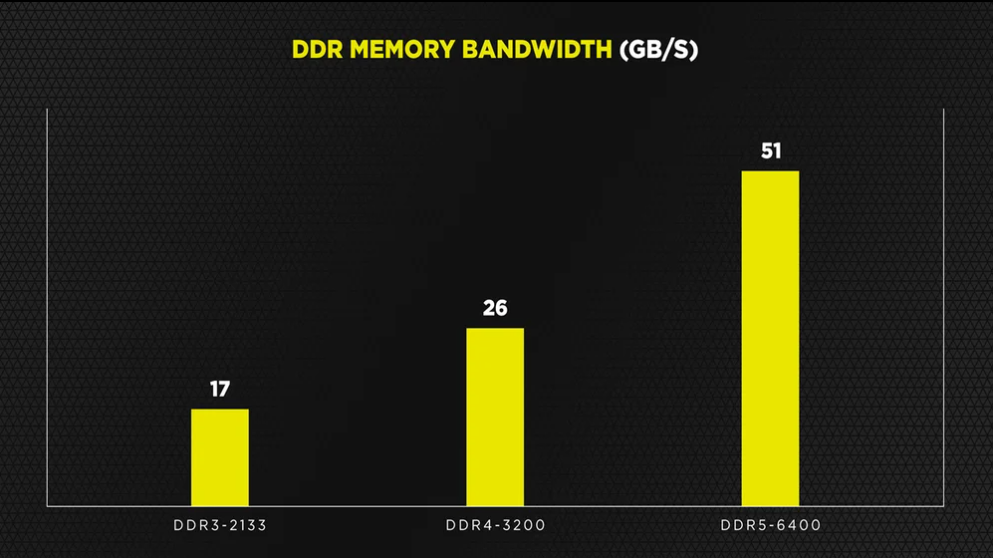

---
## 3) Investigación — DDR5
Responde con apoyo de fuentes (cítalas al final de este archivo).

1. **Ventajas frente a DDR4:** DDR5 destaca por dar un mayor ancho de banda, una gestión de energía más eficiente gracias al PMIC integrado, una arquitectura interna mejorada, corrección de errores y soporte para perfiles modernos como el XMP 3.0. Esto es por su diseño de doble canal con 32 bancos, en comparación con los 16 de DDR4, lo que le permite alcanzar un ancho de banda superior. Además, la regulación y eficiencia son mejores gracias al PMIC integrado, lo que resulta en menos errores y mayor densidad con ECC on-die. También ofrece más paralelismo gracias a su arquitectura con más bancos y subcanales, y facilita la configuración o el overclock mediante perfiles EXPO/XMP 3.0.

2. **Usos donde se aprecia la diferencia:** La diferencia se nota especialmente en tareas exigentes como la edición de vídeo, el renderizado 3D o cualquier actividad que requiera un uso intensivo del ancho de banda. Esto se traduce en tiempos de procesamiento más cortos y un sistema más fluido. En el ámbito de los videojuegos, especialmente en aquellos que son “CPU-bound” o que demandan muchos recursos de memoria, también se percibe una mejora, aunque es menos pronunciada. En resoluciones altas o en juegos que dependen en gran medida de la GPU, la diferencia no es tan evidente.

3. **Ejemplo ventajoso:** DDR5 resulta muy útil para la edición de vídeo en 4K/8K o en proyectos multipista con renderizado. Su mayor ancho de banda permite acceder y mover datos de manera mucho más rápida, lo que reduce los tiempos de renderizado y mejora la fluidez de la previsualización, haciendo que trabajar con archivos pesados sea mucho más ágil. Otro ejemplo sería un sistema que ejecuta múltiples procesos en memoria simultáneamente, con varios programas abiertos que consumen mucha memoria. En este caso, la capacidad superior por módulo y el mayor throughput de DDR5 facilitan la gestión de toda esa carga sin que el sistema se quede “atascado”.

*Rendimiento en cinebench*
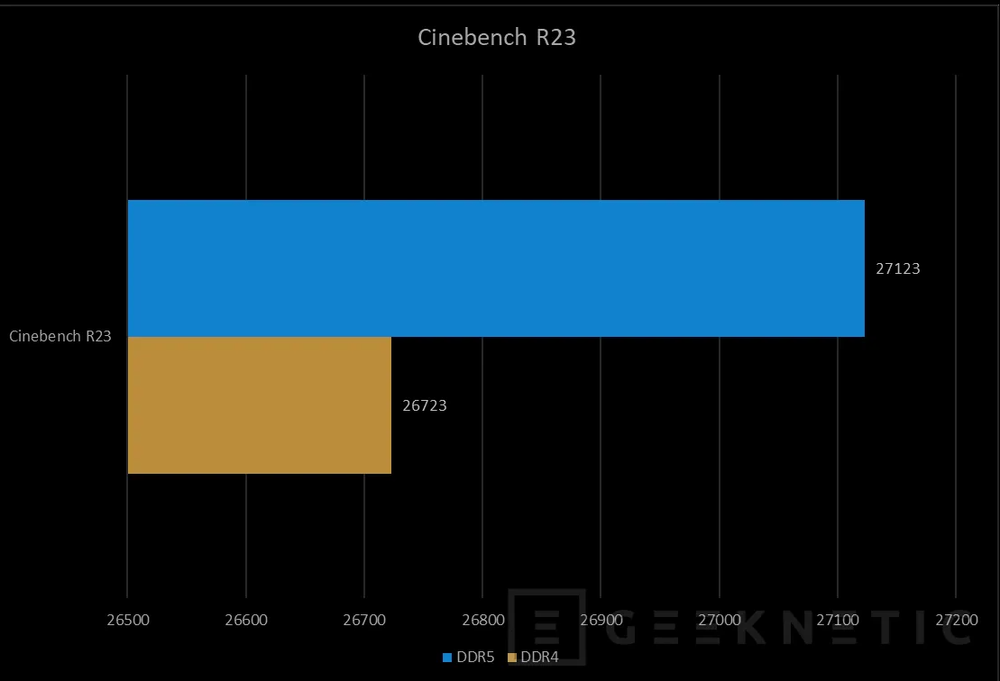

---
## 4) Fuentes
##### 1) Búsqueda en tienda online
###### - RAM
- [Oficina](https://www.pccomponentes.com/crucial-ct16g4dfra32a-ddr4-3200mhz-pc4-25600-16gb-cl22)
- [Gaming](https://www.pccomponentes.com/memoria-ram-kingston-64gb-ddr5-6000mt-s-fury-beast-rgb-expo-kit-2x32gb)
###### - Microprocesador
- [Oficina](https://www.pccomponentes.com/procesador-amd-ryzen-5-8600g-ia-integrada-43-5ghz-box)
- [Gaming](https://www.pccomponentes.com/procesador-amd-ryzen-9-9950x3d-43-57ghz-box)
##### 2) Tabla comparativa — Tipos de RAM encontrados
- [Memorias RAM DDR4 vs DDR5: ¿Qué merece más la pena actualmente?](https://www.pccomponentes.com/memorias-ram-ddr4-vs-ddr5)
- [RAM DDR4 vs DDR5: ¿Cuál es la diferencia?](https://www.corsair.com/es/es/explorer/diy-builder/memory/is-ddr5-better-than-ddr4/)
##### 3) Investigación — DDR5
- [DDR4 vs DDR5: Comparativa de Rendimiento](https://www.geeknetic.es/Guia/2244/DDR4-vs-DDR5-Comparativa-de-Rendimiento.html)
- [DDR4 vs DDR5 RAM: ¿merece la pena actualizarse en 2025?](https://www.geekom.es/ddr4-vs-ddr5/)
- [Memoria RAM DDR5: estás son sus características y rendimiento](https://hardzone.es/tutoriales/componentes/memoria-ram-ddr4-vs-ddr5/)

---
## Parte 3 — GPUs blackfriday
# Parte 3 — GPUs y precios reales (Black Friday 2025)

> Vídeo: **“Mejores Tarjetas Gráficas Calidad - Precio | TOP GPUs GAMING Black Friday 2025”**  
> URL: https://www.youtube.com/watch?v=ILOtkTXLUvg
## 0) Portada
- Alumno/a: _Andrés López_
- Grupo: _ASIR1_
- Fecha: _03/12/2025_

## 1) Introducción (5–10 líneas)
En este vídeo se comparan distintas graficas en distintos rangos de precio. Desde las más asequibles y funcionales, aunque no sean muy recomendadas, hasta las más caras que tienen un precio más bajo por las ofertas. Se comparan dos opciones de GPU por cada rango de precio analizando su rendimiento en videojuegos o si pueden estar enfocadas para IA local. Sobre todo destaca la diferencia de Nvidia y la tecnología de DLSS con las de AMD que no y otros componentes recomendados compatibles con dichas gráficas. Por último, fuera de rangos de precios asequibles, compara los mejores modelos de GPUs de Nvidia, recomendando preferir la RT5070 Ti sobre la 5080, por su calidad-precio.
## 2) Tramos del vídeo y modelos mencionados
### 2.1 Tramo ~350 €
- Minuto inicio–fin: **07:43 – 09:31**
- GPUs citadas (2): **RTX 5060 Ti**, **RX 9060 XT 16GB**

### 2.2 Tramo 600–800 €
- Minuto inicio–fin: **11:36 – 14:07**
- GPUs citadas (2): **RTX 5070 Ti**, **RX 9070 XT**

**¿Se repite algún modelo entre tramos?**: Sí, la RX 9060 XT. Distingue el modelo de 8GB de VRAM y el de 16GB VRAM. El de 8GB es considerablemente más barato que el de 16, y a pesar de ser exactamente el mismo chip y tener un consumo parecido, la diferencia es notoria al jugar en 1440p, por eso recomienda ambas para ajustarse a cada presupuesto.

## 3) Precios reales en tiendas
> Inserta imágenes en `assets/img/30-parte3/` y enlaza con ruta relativa.

### 3.1 GPU del tramo 350 € — Modelo A
- **Tienda:** Amazon
- **Nombre exacto en tienda:** sapphire technology Pulse AMD Radeon RX 9060 XT Gaming OC, 16GB Dual HDMI-DP
- **Precio (€):** 391,96 €
- **URL:** [Amazon 📎](https://www.amazon.es/Sapphire-Pulse-Radeon-9060-16GB/dp/B0F8C6MWSY?crid=2GX4T85GV0KMV&dib=eyJ2IjoiMSJ9.cJ5NUnN7f6IrMNXeSRJtNSo0nUvXx7T4i0tkDIPwtUgwIaxU_N6VT0TwU2436gHBYCcNgUzripkITXdVcFciKfwFxISPL2QYy_EGe0W0lXB4dLRG6rneEv39mrsu5RdW8cFHrj_pT3uoGMpjNsTav0bnH_ycHIiVwASvPvnBk4bvVMhvzSgomLV_2QaIZpOmiHk7Xc_emHzDlPVkiYoshhXnV_dgW0aIIhW6F_3WIimVq2kg4yRN5vpEBYrr6W3ZgEhd25K96XwuN7P2w28zI-Ovxyk-GHuaZxMTlkMsJVg.TVrEKtvp43Q1j7fctbc0U8mYktlOoyUggl2wwACIcC8&dib_tag=se&keywords=rx+9060+xt+16gb&qid=1763066076&sprefix=RX+9060+XT+,aps,71&sr=8-1&ufe=app_do:amzn1.fos.73cb57b4-37b0-490e-9d49-9873e628f7ec&linkCode=sl1&tag=aro013-21&linkId=fb093b31cc3a027b852de7035dac4af3&language=es_ES&ref_=as_li_ss_tl)
- **Imagen:** 
-  

### 3.2 GPU del tramo 350 € — Modelo B
- **Tienda:** PC Componentes
- **Nombre exacto en tienda:** Tarjeta Gráfica Palit GeForce RTX 5060 Ti Infinity 3 16GB GDDR7 Reflex 2 RTX AI DLSS4
- **Precio (€):** 449,90 €
- **URL:** [PC componentes 📎](https://www.pccomponentes.com/tarjeta-grafica-palit-geforce-rtx-5060-ti-infinity-3-16gb-gddr7-reflex-2-rtx-ai-dlss4?utm_source=790799&utm_medium=afi&utm_campaign=www.youtube.com&sv1=affiliate&sv_campaign_id=790799&awc=20982_1764772726_e6824a51ea8b6824f1b4e308e3b409fb&utm_term=deeplink&utm_content=)
- **Imagen:** 
- 

### 3.3 GPU del tramo 600–800 € — Modelo C
- **Tienda:** Amazon
- **Nombre exacto en tienda:** Sapphire Pulse AMD Radeon™ RX 9070 XT Gaming 16GB Dual HDMI/Dual DP
- **Precio (€):** 629,90 €
- **URL:** [Amazon 📎](https://www.amazon.es/Sapphire-Pulse-RadeonTM-9070-Gaming/dp/B0DRPRZMK2?__mk_es_ES=%C3%85M%C3%85%C5%BD%C3%95%C3%91&crid=1XA9HLCUSZ2UT&dib=eyJ2IjoiMSJ9.lfBrQssOzVi6p0HW2BGE9wGNb-Pbt_sJjSmQK9O9h7SvSyWHYy58WZOOuy335Jm9soPYCyeI2JS9A6WJPvxsPH6RZ6TQTco6_mj6QTCuPTxjASu5-pr-EaebliddYCOZhTF5_G7ZKepO57e6hnCUZ8ruzILtomoVhuXgam1nqw5oUxuQJ9RwqTXOY0r4VOEPftaGV7YuPPk0OVcbHpmXR80eCGa8lZ5aMpkcCyG8foYEHNzeVYJKGnJNMfehtf7cNtTbICgSn6f76328VO9Eyr1P1Q0iuLEJzPb60m9GLn8.2i4Q5-NuSstIue_Hoqmpk_7D0V3lCUEiaUkC3JhCGYk&dib_tag=se&keywords=rx+970+xt&qid=1763066190&sprefix=rx+9070+xt,aps,75&sr=8-1&ufe=app_do:amzn1.fos.36393ef6-f0da-44a9-8c13-668db228262a&linkCode=sl1&tag=aro013-21&linkId=f67a28719172d86e307369cf96d7aa0b&language=es_ES&ref_=as_li_ss_tl)
- **Imagen:** 
 - 

### 3.4 GPU del tramo 600–800 € — Modelo D
- **Tienda:** PC Componentes
- **Nombre exacto en tienda:** Tarjeta Gráfica PNY GeForce RTX 5070 Ti 16GB GDDR7 Reflex 2 RTX AI DLSS4
- **Precio (€):** 840,35€
- **URL:** [PC Componentes 📎](https://www.pccomponentes.com/tarjeta-grafica-pny-geforce-rtx-5070-ti-16gb-gddr7-reflex-2-rtx-ai-dlss4?utm_source=790799&utm_medium=afi&utm_campaign=www.youtube.com&sv1=affiliate&sv_campaign_id=790799&awc=20982_1764772330_b3e6b068e4ce93b366fe23dd5707c08a&utm_term=deeplink&utm_content=)
- **Imagen:** 
- 

> Nota: Si no encuentras el mismo **ensamblador**, indica la diferencia manteniendo la misma **GPU**.

## 4) Tabla comparativa (precios reales)
| Tramo (vídeo) | GPU (modelo del vídeo)          | Tienda         | Precio (€) | URL                                                                                                                                                                                                                              | Imagen                                                |
| ------------- | ------------------------------- | -------------- | ---------: | -------------------------------------------------------------------------------------------------------------------------------------------------------------------------------------------------------------------------------- | ----------------------------------------------------- |
| 350 €         | AMD Radeon RX 9060 XT 16GB VRAM | Amazon         |    391,96€ | [📎](https://www.amazon.es/Sapphire-Pulse-Radeon-9060-16GB/dp/B0F8C6MWSY?sr=8-1&language=es_ES)                                                                                                                                  |  |
| 350 €         | GeForce RTX 5060 Ti             | PC Componentes |    449,90€ | [📎](https://www.pccomponentes.com/tarjeta-grafica-palit-geforce-rtx-5060-ti-infinity-3-16gb-gddr7-reflex-2-rtx-ai-dlss4?sv1=affiliate&sv_campaign_id=790799&awc=20982_1764772726_e6824a51ea8b6824f1b4e308e3b409fb&utm_content=) |  |
| 600–800 €     | AMD Radeon™ RX 9070 XT          | Amazon         |    629,90€ | [📎](https://www.amazon.es/Sapphire-Pulse-RadeonTM-9070-Gaming/dp/B0DRPRZMK2?__mk_es_ES=%C3%85M%C3%85%C5%BD%C3%95%C3%91&sr=8-1&language=es_ES)                                                                                   |  |
| 600–800 €     | GeForce RTX 5070 Ti             | PC Componentes |    840,35€ | [📎](https://www.pccomponentes.com/tarjeta-grafica-pny-geforce-rtx-5070-ti-16gb-gddr7-reflex-2-rtx-ai-dlss4?sv1=affiliate&sv_campaign_id=790799&awc=20982_1764772330_b3e6b068e4ce93b366fe23dd5707c08a&utm_content=)              |  |

## 5) Conclusión (5–8 líneas)
- ¿Los precios reales se parecen a lo que sugiere el vídeo?
	Sí, los precios estan rondando el margen que propone el video. Pero varían dependiendo de las ofertas de blackfriday. Tambien cambia dependiendo de la tienda entoces cada gráfica individualmente se encuentra dentro de su propio margen.
	
- ¿Cuál de las cuatro ofrece mejor **calidad-precio** y por qué?
	La RX 9070 XT es una de las mejores del video calidad-precio. Con un coste medio-alto para ordenadores de esa gama. Ofrece un buen rendimiento sin necesidad de tecnologías de Nvidia.
	
- Observaciones finales.
	Las recomendaciones se adaptan bien a cada presupuesto, diferenciándose claramente entre Nvidia y AMD, mientras que Intel se queda para la gama baja. Se destaca la VRAM en cada modelo, buscando el equilibrio entre 8GB y más de 12GB. Los ejemplos de rendimiento en juegos ayudan a ver como rinden con un uso real de gaming o IA.

## 6) Fuentes
###### Tiendas:
- [GPU A](https://www.amazon.es/Sapphire-Pulse-Radeon-9060-16GB/dp/B0F8C6MWSY?sr=8-1&language=es_ES)
- [GPU B](https://www.pccomponentes.com/tarjeta-grafica-palit-geforce-rtx-5060-ti-infinity-3-16gb-gddr7-reflex-2-rtx-ai-dlss4?sv1=affiliate&sv_campaign_id=790799&awc=20982_1764772726_e6824a51ea8b6824f1b4e308e3b409fb&utm_content=)
- [GPU C](https://www.amazon.es/Sapphire-Pulse-RadeonTM-9070-Gaming/dp/B0DRPRZMK2?__mk_es_ES=%C3%85M%C3%85%C5%BD%C3%95%C3%91&sr=8-1&language=es_ES)
- [GPU D](https://www.pccomponentes.com/tarjeta-grafica-pny-geforce-rtx-5070-ti-16gb-gddr7-reflex-2-rtx-ai-dlss4?sv1=affiliate&sv_campaign_id=790799&awc=20982_1764772330_b3e6b068e4ce93b366fe23dd5707c08a&utm_content=)
###### Vídeo:
- [YouTube](https://www.youtube.com/watch?v=ILOtkTXLUvg)
